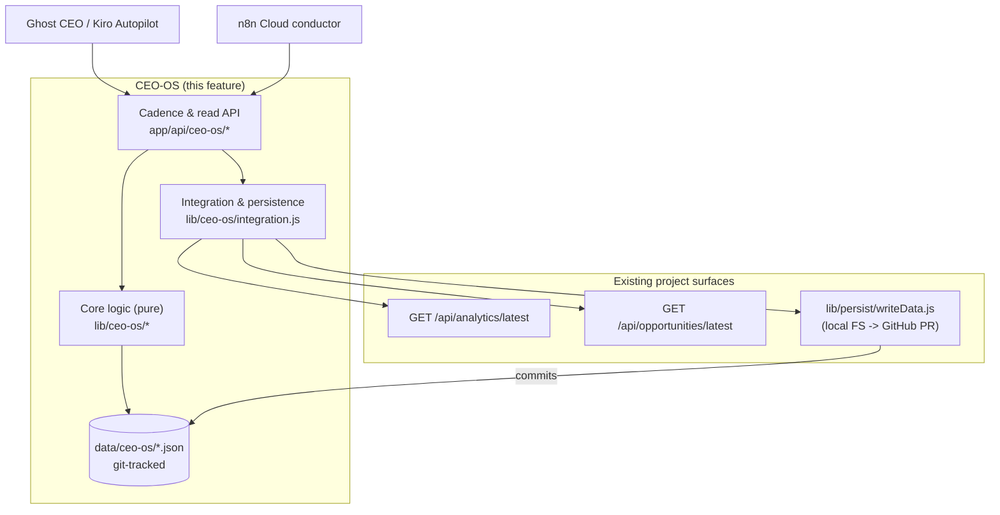

# Design Document

## Overview

The CEO Operating System (CEO-OS) is the management framework the Ghost CEO uses to run Ghost Corporation — the operating company behind the Summer Finds Lab Daily affiliate engine. The CEO defines priorities, allocates tasks, monitors departments, reviews reports, detects bottlenecks, and decides escalations. Execution is delegated to AI-agent departments (Kiro Autopilot plus the n8n automation layer).

This design implements the six CEO-OS deliverables — the Operating Model, Priority/Task management, the Department Structure, the Daily and Weekly cadences, the KPI Dashboard, the Bottleneck Detector, and the Escalation Process — as a file-based, git-tracked system that is fully consistent with the project's existing architecture:

- **All canonical data lives in git-tracked flat JSON files** under `data/` (ADR-001). The CEO-OS stores its registers and records under `data/ceo-os/`. There is no database.
- **Durable write-back reuses the existing persistence layer.** Every CEO-OS write goes through `lib/persist/writeData.js`, which tries the local filesystem, falls back to the GitHub Contents API write-back (`lib/persist/githubCommit.js`, branch `auto/data-<date>` + PR), and otherwise degrades to `persisted:false`. The CEO-OS introduces no new persistence mechanism.
- **Operational data is consumed from existing endpoints.** The KPI Dashboard, Daily Reports, and Weekly Reviews read site analytics from `GET /api/analytics/latest` (the latest `MetricSnapshot`) and product-opportunity data from `GET /api/opportunities/latest` (the latest Opportunity Intelligence report). Both are unauthenticated read routes that 404 on first run.
- **n8n Cloud is the conductor.** n8n owns schedules and retries (ADR-007/009): it calls CEO-OS cadence endpoints at the times recorded in the Operating Model (daily report generation, weekly review). n8n never owns canonical data — it triggers route handlers that read existing data and write CEO-OS records back through the persistence layer.
- **The system optimizes the primary KPI** — monthly outbound clicks to Amazon — and the secondary KPIs — pins published per week and Pinterest outbound clicks. Raw pageviews are explicitly excluded from any KPI that carries a target or that is used to justify a priority's rank.

The deliverable is a layered design: a set of JSON **data stores** with defined schemas; a layer of pure **core logic** modules (`lib/ceo-os/`) that implement ranking, validation, monitoring, bottleneck detection, escalation routing, and KPI computation; an **integration** module that reads the analytics/opportunities endpoints with graceful degradation and persists records through `writeData.js`; and a thin **cadence/API layer** that n8n and the CEO invoke.

## Architecture

### System context



### Layers

1. **Data stores (`data/ceo-os/`)** — the authoritative, git-tracked JSON registers and dated records. These are the single source of truth for everything the CEO-OS owns (priorities, tasks, departments, KPI config, daily reports, weekly reviews, escalations, operating model).

2. **Core logic (`lib/ceo-os/`)** — pure, side-effect-free functions over plain JSON values. This is where ranking invariants, task validation, reporting-status derivation, KPI variance computation, bottleneck rules, escalation classification/routing, and the revenue-maximization ordering live. Pure functions make this layer the target of property-based testing.

3. **Integration (`lib/ceo-os/integration.js`)** — the only layer that performs I/O. It reads the analytics and opportunities endpoints (translating 404/network failures into a `data-unavailable` marker), and persists CEO-OS records by calling `writeDataFiles` from the existing persistence layer with stable, deterministic file paths.

4. **Cadence & read API (`app/api/ceo-os/*`)** — Next.js route handlers following the project's `[ANCHOR:api-pattern]`. Read routes for the CEO-OS's own aggregate data (dashboard, monitor) are unauthenticated; write/cadence routes (daily report generation, weekly review, mutations to priorities/tasks/escalations) validate a single shared secret via `Authorization: Bearer` or an `x-ceo-os-secret` header.

### Why this structure

Separating pure logic from I/O matches the existing repo (`lib/feedback/score.js` is pure; `app/api/.../route.js` does I/O). It keeps the testable business rules independent of the filesystem and the GitHub API, and it lets n8n drive cadences without owning data. Storing each register as a single JSON file (with records keyed by stable id) gives clean upsert semantics, while dated records (daily reports, weekly reviews) live in per-date files so history is preserved naturally in git.

### Directory layout

```
data/ceo-os/
  operating-model.json          # Operating_Model (machine-readable cadence/loop record)
  priorities.json               # Priority_Register (+ rank history)
  tasks.json                    # Task_Allocation_System
  departments.json              # Department_Register (seeded, seven departments)
  kpis.json                     # KPI_Dashboard configuration
  escalations.json              # Escalation_Process log
  reports/daily/<YYYY-MM-DD>.json    # Daily_Report records for that operating day
  reviews/weekly/<YYYY-MM-DD>.json   # Weekly_Review_Record for that week
docs/ceo-os/
  operating-model.md            # Human-readable Operating_Model narrative (git-tracked)

lib/ceo-os/
  store.js          # read/list/upsert helpers over data/ceo-os (reuses writeData.js)
  ids.js            # stable id construction (pri-*, task-*, esc-*, dr-*, wr-*)
  priorities.js     # ranking invariants, re-rank with history
  tasks.js          # task validation, status transitions, blocked-day tracking
  departments.js    # department register access + referential integrity
  kpi.js            # KPI variance, data-unavailable, sourcing rules
  monitor.js        # department monitoring (reporting status, open-task counts)
  reports.js        # daily report assembly + blocker -> escalation
  reviews.js        # weekly review assembly, trend comparison, re-prioritization
  bottlenecks.js    # bottleneck detection rules
  escalations.js    # severity classification, status, routing, P0 timeout
  integration.js    # endpoint reads (graceful degradation) + persistence

app/api/ceo-os/
  dashboard/route.js     # GET  - KPI dashboard (read, unauthenticated)
  monitor/route.js       # GET  - department monitoring (read, unauthenticated)
  daily-report/route.js  # POST - generate/ingest a daily report (authed, n8n)
  weekly-review/route.js # POST - run the weekly review (authed, n8n)
  priorities/route.js    # POST - create/re-rank priorities (authed)
  tasks/route.js         # POST - allocate/update tasks (authed)
  escalations/route.js   # POST - raise/decide escalations (authed)
```

## Components and Interfaces

All `lib/ceo-os/` modules use the project's conventions: 4-space indent, ES modules, named exports, double-quoted strings, JSDoc banners, and `getX` / `getXBySlug`-style accessor naming. The `@/` path alias resolves to the repo root.

### `lib/ceo-os/store.js` — storage primitives

The single gateway between core logic and disk. Reads import JSON directly (static, like `lib/products.js`); writes go through `writeDataFiles`.

```js
// Read a register file, returning a default shape when the file is absent (first run).
export function readRegister(name, fallback)        // name: "priorities" | "tasks" | ...
export async function writeRegister(name, value, opts) // -> writeDataFiles result {ok, persisted, via, pr?}

// Upsert one record into a collection register by stable id (Requirement 12.5).
export function upsertById(collection, record)      // pure: returns next array, replacing same-id record
export async function persistRegister(name, value, message)

// Dated records (daily reports, weekly reviews).
export function dailyReportPath(date)               // "data/ceo-os/reports/daily/<date>.json"
export function weeklyReviewPath(date)              // "data/ceo-os/reviews/weekly/<date>.json"
```

`upsertById` is pure and is the basis of the idempotence guarantee (Requirement 12.5): writing a record whose `id` already exists replaces it in place rather than appending.

### `lib/ceo-os/priorities.js` — Priority Register

```js
export function getPriorities(register)             // active priorities sorted by rank asc
export function validateRanks(register)             // -> {ok, errors[]}; unique ranks among active (2.2)
export function addPriority(register, priority)     // -> next register; assigns/normalizes rank (2.3)
export function rankPriorities(register, ordering, at) // re-rank; appends previous ranking to rankHistory (2.6)
export function linkedKpis(priority)                // kpiIds (>=1 required) (2.4)
export function isRevenuePriority(priority)         // intent flag used by 2.5
```

### `lib/ceo-os/tasks.js` — Task Allocation System

```js
export const TASK_STATUSES = ["backlog","allocated","in-progress","blocked","in-review","done"];
export function validateTask(task)                  // enforces 3.1-3.6 invariants -> {ok, errors[]}
export function allocateTask(task, department, allocatedDate, dueDate) // 3.3, 3.5
export function setStatus(task, status, day, dependencyId) // sets blockedSince on entering "blocked" (9.4); requires dependencyId when blocked (3.6)
export function isOverdue(task, today)              // allocated/active past due and not done (9.2)
export function blockedOperatingDays(task, today)   // consecutive blocked days, counting the change day as day 1 (9.4, 9.5)
```

### `lib/ceo-os/departments.js` — Department Register

```js
export const DEPARTMENTS = ["Content_and_Pages","Pinterest_Distribution","Automation",
  "GEO_SEO_Citability","Discovery_Opportunity_Intelligence","Analytics_Reporting","Compliance"];
export function getDepartments(register)
export function getDepartmentById(register, id)
export function validateReferentialIntegrity(register, dashboard) // every primaryKpiId exists in dashboard (4.7)
export function ownerForEscalation(register, originatingDepartment) // routing target (10.8)
```

### `lib/ceo-os/kpi.js` — KPI Dashboard computation

```js
export function computeKpiView(kpiConfig, currentValue, timestamp)
// Returns one of:
//   { status:"data-unavailable", current:null, target, variance:null, asOf }      (8.10, 12.4)
//   { status:"no-target", current, target:"not-set", variance:"not-set", asOf }   (8.8)
//   { status:"ok", current, target, variance: current - target, asOf }            (8.7)
export function variance(current, target)           // current - target
export function isTargetedPageview(kpiConfig)        // guard for 8.4 / 11.4 (must always be false in a valid dashboard)
export function sourceFor(kpiConfig)                 // "analytics-endpoint" | "opportunities-endpoint" (8.5, 8.6)
```

### `lib/ceo-os/monitor.js` — Department monitoring

```js
export function openTaskCountsByStatus(tasks, departmentId)   // {backlog, allocated, "in-progress", blocked, "in-review"} (5.1)
export function reportingStatus(dailyReport, departmentId)    // "reporting" | "not-reporting" (5.3, 5.4)
export function departmentMonitorRow(department, dashboardView, tasks, dailyReport) // 5.1, 5.5
```

`reportingStatus` is a pure function of whether a daily report exists for the department on that day — it returns `"not-reporting"` whenever the report is absent, **regardless of any outage or maintenance flag** (Requirement 5.3).

### `lib/ceo-os/reports.js` — Daily Reporting Framework

```js
export function buildDailyReport({ date, department, completed, inProgress, blockers, kpiValue, analyticsView, opportunitySummary })
// Assembles a Daily_Report record (6.1). Includes outbound-click figures from analytics (6.3)
// and, for Discovery_Opportunity_Intelligence, the opportunity summary (6.4).
export function escalationsFromBlockers(report)     // blockers with severity P0|P1 -> escalation drafts (6.6)
export function validateBlockers(report)            // every blocker carries a Severity_Tier (6.5)
```

### `lib/ceo-os/reviews.js` — Weekly Review Framework

```js
export function compareKpis(thisWeek, priorWeek)    // per-KPI trend vs prior week (7.3)
export function buildWeeklyReview({ date, kpiTrends, departmentPerformance, bottlenecks, decisions })
export function correctivePrioritiesFor(kpiTrends)  // declines -> corrective priority drafts (7.5)
export function confirmAllRanks(review, register)   // every active priority's rank confirmed/updated (7.6)
export function contributingDepartments(kpiTrends, departments) // primary met/exceeded -> depts (11.5)
export function hasKpiTargetedDecision(review)      // >=1 decision targets primary/secondary KPI (11.2)
```

### `lib/ceo-os/bottlenecks.js` — Bottleneck Detector

```js
// Each rule returns a flag {affectedDepartment, affectedKpi, rule, severity} or null.
export function flagOverdueTask(task, today)                 // 9.2
export function flagBlockedTask(task, today)                 // 9.5 (uses blocked-day count, 9.4)
export function flagDecliningDepartment(department, kpiHistory) // 9.3 (two consecutive periods)
export function detectBottlenecks({ tasks, departments, kpiHistory, today }) // 9.1
export function bottlenecksToEscalations(flags)              // 9.6, 9.7
```

### `lib/ceo-os/escalations.js` — Escalation Process

```js
export const ESCALATION_STATUSES = ["open","in-review","decided","closed"];
export const SEVERITY_TIERS = ["P0","P1","P2","P3"];
export function classifyCompliance(violation)       // FTC/Amazon Associates violation -> "P0" (10.3)
export function createEscalation(draft, register, now)  // assigns id, routes to owning dept (10.2, 10.8); sets timeoutAt for P0 (10.5)
export function decideEscalation(escalation, decision, decisionDate, resulting) // records decision + resulting task/priority (10.7)
export function isGating(escalation, now)            // P0 open within timeout blocks dependent work (10.4); false after timeout (10.5)
export function validateEscalation(escalation)       // status enum + decided-fields invariant (10.6, 10.7)
```

### `lib/ceo-os/integration.js` — endpoint reads + persistence

```js
// Reads with graceful degradation. On 404 / network error returns {available:false}.
export async function readAnalyticsLatest(baseUrl)   // -> {available, snapshot} (12.1)
export async function readOpportunitiesLatest(baseUrl) // -> {available, report} (12.2)
export function outboundClicksFromSnapshot(snapshot) // sums item.outboundClicks
export function pinsPublishedThisWeek(/* from data/pinterest-published.json */)
// Persistence (delegates to writeData.js, never re-implements write-back).
export async function persist(name, value, message)  // (12.3, 12.5)
```

`readAnalyticsLatest` / `readOpportunitiesLatest` translate the documented `404 {ok:false,error:"no_snapshot"|"no_report"}` first-run responses, and any network failure, into `{available:false}`. Callers then mark the affected KPI `data-unavailable` and continue producing the rest of the output (Requirements 8.10, 12.4).

### API layer (`app/api/ceo-os/*`)

Every route sets `export const runtime = "nodejs"` and `export const dynamic = "force-dynamic"`, returns the `{ok:boolean,...}` envelope, and uses status codes 401/400/500/200 (including `persisted:false` graceful degradation). Read routes (`dashboard`, `monitor`) are unauthenticated because they expose only the company's own aggregate data, matching the existing analytics/opportunities read routes. Write/cadence routes validate a single shared secret (`CEO_OS_INGEST_TOKEN`) via `Authorization: Bearer` or `x-ceo-os-secret`, matching the existing ingest routes.

> Security note: the cadence/mutation routes change company state (priorities, tasks, escalations) and therefore require the shared secret. The read routes are intentionally unauthenticated and must never expose secrets or PII — they only aggregate metrics about our own content, consistent with `/api/analytics/latest`.

## Data Models

All records use stable, deterministic ids so repeated writes upsert (Requirement 12.5). Files are pretty-printed JSON with a trailing newline (matching the existing ingest routes) and committed via the persistence layer.

### Operating_Model — `data/ceo-os/operating-model.json`

```jsonc
{
  "version": 1,
  "updatedAt": "2026-05-31T00:00:00Z",
  "mission": "Maximize monthly outbound clicks to Amazon for Ghost Corporation.",
  "responsibilities": [
    "define-priorities", "allocate-tasks", "monitor-departments",
    "review-reports", "detect-bottlenecks", "decide-escalations",
    "maximize-traffic-clicks-revenue"
  ],                                              // Requirement 1.1
  "decisionLoop": ["prioritize", "delegate", "monitor", "review", "decide"], // 1.2
  "roles": {
    "ghostCeo": "direction-and-decision",         // 1.3
    "aiAgentEmployees": "execution"               // 1.3
  },
  "kpis": { "primary": "primary-amazon-clicks",   // 1.4 (top-ranked objective)
            "secondaryLeadingIndicators": ["secondary-pins-per-week", "secondary-pinterest-clicks"] },
  "deliverables": [                               // 1.5, 1.6, 1.7
    { "id": "operating-model",     "cadence": "on-change",      "interval": null,     "timeUtc": null },
    { "id": "daily-reporting",     "cadence": "recurring",      "interval": "P1D",    "timeUtc": "00:05" },
    { "id": "weekly-review",       "cadence": "recurring",      "interval": "P1W",    "timeUtc": "Mon 08:00" },
    { "id": "kpi-dashboard",       "cadence": "on-data-update", "interval": null,     "timeUtc": null },
    { "id": "department-structure","cadence": "on-change",      "interval": null,     "timeUtc": null },
    { "id": "escalation-process",  "cadence": "event-driven",   "interval": null,     "timeUtc": null }
  ]
}
```

A human-readable companion lives at `docs/ceo-os/operating-model.md` (Requirement 1.8 — both are git-tracked).

### Priority_Register — `data/ceo-os/priorities.json`

```jsonc
{
  "version": 1,
  "priorities": [
    {
      "id": "pri-0001",                          // stable unique id (2.1, 12.5)
      "description": "Ship 20 high-intent gift roundups",
      "targetOutcome": "+1,200 monthly Amazon outbound clicks", // 2.1, 2.3
      "ownerDepartment": "Content_and_Pages",     // 2.1
      "rank": 1,                                  // 2.1, 2.2 (unique among active)
      "kpiIds": ["primary-amazon-clicks"],        // 2.4 (>=1), 2.5 (revenue -> primary/secondary)
      "revenueIntent": true,                       // drives 2.5 check
      "expectedOutboundClickImprovement": 1200,    // tie-break metric for 11.3
      "status": "active",                          // active | archived
      "createdAt": "2026-05-31T00:00:00Z",
      "updatedAt": "2026-05-31T00:00:00Z"
    }
  ],
  "rankHistory": [                                 // 2.6 (dated previous rankings)
    { "recordedAt": "2026-05-24T08:00:00Z", "reason": "weekly-review",
      "ranking": [ { "id": "pri-0001", "rank": 2 } ] }
  ]
}
```

### Task — `data/ceo-os/tasks.json`

```jsonc
{
  "version": 1,
  "tasks": [
    {
      "id": "task-0001",                          // 3.1, 12.5
      "objective": "Draft and publish 5 gift guides",
      "ownerDepartment": "Content_and_Pages",     // exactly one (3.3)
      "severity": "P2",                           // Severity_Tier (3.1)
      "priorityId": "pri-0001",                   // 3.4
      "status": "allocated",                      // enum (3.2)
      "allocatedDate": "2026-05-31",              // 3.5
      "dueDate": "2026-06-07",                    // 3.5
      "blockingDependencyId": null,               // required while blocked (3.6)
      "blockedSince": null,                        // YYYY-MM-DD set on entering blocked (9.4)
      "createdAt": "2026-05-31T00:00:00Z",
      "updatedAt": "2026-05-31T00:00:00Z"
    }
  ]
}
```

### Department_Register — `data/ceo-os/departments.json`

Seeded once with the seven departments (Requirement 4.1).

```jsonc
{
  "version": 1,
  "departments": [
    { "id": "Content_and_Pages",              "charter": "...", "agents": ["kiro-autopilot"],
      "primaryKpiId": "primary-amazon-clicks", "dataSource": "data-store", "n8nWorkflows": [] },
    { "id": "Pinterest_Distribution",         "charter": "...", "agents": ["kiro-autopilot","n8n:WF-04"],
      "primaryKpiId": "secondary-pinterest-clicks", "dataSource": "analytics-endpoint", "n8nWorkflows": ["WF-04"] },
    { "id": "Automation",                     "charter": "...", "agents": ["n8n"],
      "primaryKpiId": "secondary-pins-per-week", "dataSource": "data-store",
      "n8nWorkflows": ["WF-01","WF-02","WF-04","WF-06"] },                          // 4.3
    { "id": "GEO_SEO_Citability",             "charter": "...", "agents": ["kiro-autopilot"],
      "primaryKpiId": "primary-amazon-clicks", "dataSource": "analytics-endpoint", "n8nWorkflows": [] },
    { "id": "Discovery_Opportunity_Intelligence","charter": "...", "agents": ["n8n:WF-06"],
      "primaryKpiId": "opportunity-outbound-clicks", "dataSource": "opportunities-endpoint",
      "n8nWorkflows": ["WF-06"] },                                                  // 4.4
    { "id": "Analytics_Reporting",            "charter": "...", "agents": ["kiro-autopilot"],
      "primaryKpiId": "primary-amazon-clicks", "dataSource": "analytics-endpoint", "n8nWorkflows": [] }, // 4.5
    { "id": "Compliance",                     "charter": "FTC disclosure + Amazon Associates policy adherence",
      "agents": ["kiro-autopilot"], "primaryKpiId": "compliance-pass-rate", "dataSource": "data-store",
      "responsibilities": ["ftc-disclosure","amazon-associates-policy"] }           // 4.6
  ]
}
```

Each `primaryKpiId` must reference a KPI in `kpis.json` (Requirement 4.7 — referential integrity, validated by `departments.validateReferentialIntegrity`).

### KPI_Dashboard — `data/ceo-os/kpis.json`

```jsonc
{
  "version": 1,
  "kpis": [
    { "id": "primary-amazon-clicks", "name": "Monthly outbound clicks to Amazon",
      "definition": "Sum of outbound affiliate clicks to Amazon in the calendar month",
      "source": "analytics-endpoint", "tier": "primary",                  // 8.2
      "target": 5000, "measurementPeriod": "monthly", "carriesTarget": true }, // 8.1, 8.7
    { "id": "secondary-pins-per-week", "name": "Pins published per week",
      "definition": "Count of pins published in the ISO week", "source": "data-store",
      "tier": "secondary", "target": 35, "measurementPeriod": "weekly", "carriesTarget": true }, // 8.3
    { "id": "secondary-pinterest-clicks", "name": "Pinterest outbound clicks",
      "definition": "Outbound clicks originating from Pinterest", "source": "analytics-endpoint",
      "tier": "secondary", "target": 400, "measurementPeriod": "weekly", "carriesTarget": true }, // 8.3
    { "id": "opportunity-outbound-clicks", "name": "Outbound clicks from product opportunities",
      "definition": "Outbound clicks attributed to scored product opportunities",
      "source": "opportunities-endpoint", "tier": "diagnostic",            // 8.6
      "target": null, "measurementPeriod": "daily", "carriesTarget": false }, // 8.8
    { "id": "compliance-pass-rate", "name": "Compliance pass rate",
      "definition": "Share of audited pages passing FTC + Associates checks", "source": "data-store",
      "tier": "diagnostic", "target": 1.0, "measurementPeriod": "weekly", "carriesTarget": true }
  ]
}
```

Raw pageviews are not present as a targeted KPI (Requirement 8.4). `source` distinguishes analytics-sourced engagement values from opportunity-sourced product values (Requirements 8.5, 8.6).

### Daily_Report — `data/ceo-os/reports/daily/<YYYY-MM-DD>.json`

One file per operating day, holding the department reports for that day. Each report is keyed by a stable id `dr-<date>-<department>` (Requirement 12.5); the day file is the dated, git-tracked artifact (Requirement 6.7).

```jsonc
{
  "date": "2026-05-31",                            // period ending at start of operating day, UTC (6.2)
  "reports": [
    {
      "id": "dr-2026-05-31-Content_and_Pages",     // stable id
      "department": "Content_and_Pages",           // 6.1
      "completed": ["Published 3 gift guides"],     // 6.1
      "inProgress": ["2 guides in review"],         // 6.1
      "blockers": [                                  // 6.1
        { "id": "blk-1", "description": "Awaiting product images", "severity": "P2",
          "dependencyId": "task-0007" }              // every blocker carries a Severity_Tier (6.5)
      ],
      "kpiValue": { "kpiId": "primary-amazon-clicks", "value": 142 }, // dept primary KPI for the day (6.1)
      "outboundClicks": { "value": 142, "source": "analytics-endpoint", "asOf": "2026-05-31T00:00:00Z" }, // 6.3
      "opportunitySummary": null                     // populated only for Discovery dept (6.4)
    }
  ]
}
```

Blockers of severity `P0`/`P1` are converted into escalation drafts and raised to the Escalation Process at report time (Requirement 6.6).

### Weekly_Review_Record — `data/ceo-os/reviews/weekly/<YYYY-MM-DD>.json`

```jsonc
{
  "id": "wr-2026-05-25",                            // stable id (12.5)
  "date": "2026-05-25",                             // fixed weekday, UTC (7.2)
  "primaryKpiTrend": { "kpiId": "primary-amazon-clicks", "current": 4200, "prior": 3800, "direction": "up" }, // 7.1, 7.3
  "secondaryKpiTrends": [                            // 7.1, 7.3, 7.4
    { "kpiId": "secondary-pins-per-week", "current": 31, "prior": 28, "direction": "up" },
    { "kpiId": "secondary-pinterest-clicks", "current": 360, "prior": 410, "direction": "down" }
  ],
  "weeklyTotals": { "pinsPublished": 31, "pinterestOutboundClicks": 360 }, // 7.4
  "departmentPerformance": [ { "department": "Pinterest_Distribution", "status": "on-track" } ], // 7.1
  "bottlenecks": [ /* flags from bottlenecks.detectBottlenecks */ ],        // 7.1
  "decisions": [                                     // 7.1
    { "type": "corrective-priority", "priorityId": "pri-0012", "targetsKpi": "secondary-pinterest-clicks" } // 7.5, 11.2
  ],
  "rankConfirmations": [ { "id": "pri-0001", "rank": 1, "confirmed": true } ], // 7.6
  "contributingDepartments": ["Content_and_Pages","GEO_SEO_Citability"]        // when primary met/exceeded (11.5)
}
```

### Escalation — `data/ceo-os/escalations.json`

```jsonc
{
  "version": 1,
  "escalations": [
    {
      "id": "esc-0001",                            // 10.2, 12.5
      "severity": "P0",                            // 10.1, 10.3
      "originatingDepartment": "Compliance",       // 10.2
      "ownerDepartment": "Compliance",             // routed via Department_Register (10.8)
      "description": "Missing FTC disclosure on /finds/x", // 10.2
      "status": "open",                            // enum open|in-review|decided|closed (10.6)
      "createdAt": "2026-05-31T09:00:00Z",
      "timeoutAt": "2026-05-31T13:00:00Z",         // P0 timeout -> backup decision-maker (10.5)
      "gating": true,                              // P0 blocks dependent work until decided/timeout (10.4)
      "decision": null, "decisionDate": null,      // recorded on decide (10.7)
      "resultingTaskId": null, "resultingPriorityId": null,
      "decidedBy": null
    }
  ]
}
```

### Severity tiers (config embedded in the Operating Model / Escalation Process)

| Tier | Definition | CEO response expectation |
|------|------------|--------------------------|
| P0 | Critical: compliance violation or hard blocker stopping revenue work | Decide before dependent work proceeds; backup decides after timeout |
| P1 | High: significant blocker on a primary/secondary KPI | Decide same operating day |
| P2 | Medium: localized blocker, workaround exists | Address in next daily review |
| P3 | Low: routine, stays with the department | Department resolves; no CEO action required |

## Correctness Properties

*A property is a characteristic or behavior that should hold true across all valid executions of a system — essentially, a formal statement about what the system should do. Properties serve as the bridge between human-readable specifications and machine-verifiable correctness guarantees.*

This feature is a strong fit for property-based testing because its core (`lib/ceo-os/*`) is a set of pure functions over plain JSON values: ranking, validation, status transitions, KPI variance, bottleneck rules, escalation classification/routing, and idempotent upsert. These have universal "for all" properties and a large input space. Infrastructure concerns (git-tracked file existence, reading `/api/analytics/latest` and `/api/opportunities/latest`, routing writes through `writeData.js`) are covered by smoke/integration tests in the Testing Strategy, not by PBT.

The properties below were derived from the prework analysis and consolidated to remove redundancy (e.g. the four KPI-display criteria 8.7–8.10 plus 5.5 collapse into one comprehensive KPI-view property; the task field/enum/allocation/blocked criteria 3.1/3.2/3.5/3.6 collapse into one validation property; reporting criteria 5.3/5.4 form one round-trip).

### Property 1: Priority record completeness

*For any* priority register and any valid new priority, after `addPriority` the priority is retrievable and carries a unique id, a description, a target outcome, an owning department, and a rank.

**Validates: Requirements 2.1, 2.3**

### Property 2: Active ranks are unique and ordered

*For any* priority register produced by any sequence of `addPriority` and `rankPriorities` operations, no two active priorities share the same rank, and `getPriorities` returns the active priorities sorted by ascending rank.

**Validates: Requirements 2.2**

### Property 3: Every priority links to a KPI, revenue priorities to a primary/secondary KPI

*For any* priority in a valid register, its `kpiIds` is non-empty; and *for any* priority whose `revenueIntent` is true, at least one linked KPI is of the primary or secondary tier.

**Validates: Requirements 2.4, 2.5**

### Property 4: Re-ranking preserves a dated previous ranking

*For any* priority register, re-ranking the priorities appends exactly one new `rankHistory` entry that records the previous ranks together with a `recordedAt` date, leaving prior history intact.

**Validates: Requirements 2.6**

### Property 5: Revenue-maximizing ordering

*For any* set of candidate priorities, a priority that improves the Primary_KPI is ranked above a priority that improves only a non-KPI metric; and *for any* set of candidates targeting the same KPI, ordering is by descending expected outbound-click improvement, where a candidate with zero expected improvement is still assigned a rank and remains selectable.

**Validates: Requirements 11.1, 11.3**

### Property 6: Raw pageviews are never targeted or used to justify rank

*For any* KPI dashboard, no KPI with `carriesTarget` true is a raw-pageviews metric; and *for any* priority ranking, no rank justification metric is raw pageviews.

**Validates: Requirements 8.4, 11.4**

### Property 7: Task validation invariants

*For any* task, `validateTask` accepts it if and only if it has an id, an objective, exactly one owning department, a Severity_Tier, a due date, and a status drawn from {backlog, allocated, in-progress, blocked, in-review, done}; an allocated task additionally has an allocation date and a due date; and a task whose status is blocked additionally carries the identifier of its blocking dependency.

**Validates: Requirements 3.1, 3.2, 3.5, 3.6**

### Property 8: Allocation assigns exactly one department

*For any* task and any valid set of departments, after `allocateTask` the task's owning department is exactly one member of that set.

**Validates: Requirements 3.3**

### Property 9: Tasks reference an existing priority

*For any* valid CEO-OS state, every task's `priorityId` resolves to a priority that exists in the Priority_Register.

**Validates: Requirements 3.4**

### Property 10: Overdue task detection

*For any* task and any "today" date, `flagOverdueTask` flags the task if and only if today is past its due date and its status is not done.

**Validates: Requirements 9.2**

### Property 11: Blocked-day counting and blocked-task detection

*For any* task that entered the blocked status on a given operating day, `blockedOperatingDays` counts that change day as the first blocked day, and `flagBlockedTask` flags the task if and only if it has been blocked for two or more consecutive operating days.

**Validates: Requirements 9.4, 9.5**

### Property 12: Declining-department detection

*For any* department KPI history, `flagDecliningDepartment` flags the department if and only if its primary KPI declined across two consecutive measurement periods.

**Validates: Requirements 9.3**

### Property 13: Bottleneck flags are well-formed and escalated

*For any* CEO-OS state, every flag returned by `detectBottlenecks` references an evaluated department and open task from the input and records the affected department, the affected KPI, and the triggering rule; and `bottlenecksToEscalations` maps each flag to exactly one escalation draft carrying a Severity_Tier.

**Validates: Requirements 9.1, 9.6, 9.7**

### Property 14: Department KPIs resolve to dashboard KPIs

*For any* Department_Register and KPI_Dashboard pair, every department's `primaryKpiId` resolves to a KPI defined in the dashboard.

**Validates: Requirements 4.7**

### Property 15: Open-task counts match the task set

*For any* set of tasks and any department, `openTaskCountsByStatus` returns, for each non-done status, a count equal to the number of that department's tasks in that status.

**Validates: Requirements 5.1**

### Property 16: Reporting status reflects report presence only

*For any* operating day, department, and arbitrary outage or maintenance flags, `reportingStatus` returns "reporting" if and only if a Daily_Report exists for that department on that day, and "not-reporting" otherwise; and every report row maps to a valid owning department.

**Validates: Requirements 5.2, 5.3, 5.4**

### Property 17: KPI view is correct across all data states

*For any* KPI configuration and source value, `computeKpiView` returns: when a target is defined and data is available, the current value, the target, the variance equal to current minus target, and the timestamp of the most recent source data; when no target is defined, the current value with target and variance reported as not-set; and when the source has no data for the period, a data-unavailable status whose current value is null and is never coerced to zero.

**Validates: Requirements 5.5, 8.7, 8.8, 8.9, 8.10**

### Property 18: KPI sourcing routing

*For any* KPI, `sourceFor` returns the Opportunities_Endpoint for product-opportunity KPIs and the Analytics_Endpoint for outbound-click and site-engagement KPIs.

**Validates: Requirements 8.5, 8.6**

### Property 19: Daily report assembly

*For any* inputs, `buildDailyReport` produces a record containing the report date, the owning department, completed work, in-progress work, blockers, and the department primary KPI value; its outbound-click figure is sourced from the Analytics_Endpoint (equal to the snapshot's summed outbound clicks, or marked data-unavailable); and for the Discovery_Opportunity_Intelligence department it includes an opportunity summary sourced from the Opportunities_Endpoint.

**Validates: Requirements 6.1, 6.3, 6.4**

### Property 20: Blocker severity and escalation

*For any* Daily_Report, `validateBlockers` accepts it if and only if every blocker carries a Severity_Tier; and the set produced by `escalationsFromBlockers` equals exactly the blockers whose Severity_Tier is P0 or P1.

**Validates: Requirements 6.5, 6.6**

### Property 21: Weekly review assembly

*For any* inputs, `buildWeeklyReview` produces a record containing the review date, the Primary_KPI trend, the Secondary_KPI trend, department performance, identified bottlenecks, re-prioritization decisions, and weekly totals for pins published and Pinterest outbound clicks, and contains at least one decision that targets the Primary_KPI or a Secondary_KPI.

**Validates: Requirements 7.1, 7.4, 11.2**

### Property 22: KPI trend comparison

*For any* pair of current-week and prior-week KPI values, `compareKpis` returns one trend per KPI whose direction is "up", "down", or "flat" according to the sign of current minus prior.

**Validates: Requirements 7.3**

### Property 23: Declines produce corrective priorities

*For any* set of KPI trends in which a Primary_KPI or Secondary_KPI declined relative to the prior week, `correctivePrioritiesFor` yields at least one corrective priority targeting each declined KPI.

**Validates: Requirements 7.5**

### Property 24: Every active priority's rank is confirmed

*For any* Priority_Register, `confirmAllRanks` covers every active priority exactly once.

**Validates: Requirements 7.6**

### Property 25: Meeting the primary target records contributors

*For any* weekly review in which the Primary_KPI current value meets or exceeds its target, the resulting record's contributing-departments list is non-empty.

**Validates: Requirements 11.5**

### Property 26: Escalation creation and routing

*For any* escalation draft and Department_Register, `createEscalation` produces a record with a unique id, a Severity_Tier, the originating department, a description, and a status, and sets the owning department to the register's owner for that originating department.

**Validates: Requirements 10.2, 10.8**

### Property 27: Compliance violations are P0

*For any* reported violation of FTC disclosure or Amazon Associates policy, `classifyCompliance` returns Severity_Tier P0.

**Validates: Requirements 10.3**

### Property 28: P0 gating around the timeout

*For any* open P0 escalation, `isGating` is true before its timeout (dependent work must wait for a CEO decision) and false at or after its timeout (dependent work may proceed under the backup decision-maker).

**Validates: Requirements 10.4, 10.5**

### Property 29: Escalation status is constrained

*For any* escalation, `validateEscalation` accepts it if and only if its status is one of open, in-review, decided, or closed.

**Validates: Requirements 10.6**

### Property 30: Deciding an escalation records the decision

*For any* open escalation and any decision, after `decideEscalation` the escalation's status is decided and it records the decision, the decision date, and any resulting task or priority unchanged from the inputs.

**Validates: Requirements 10.7**

### Property 31: Graceful degradation across unavailable sources

*For any* subset of data sources marked unavailable, the dashboard and report builders mark exactly the KPIs sourced from those sources as data-unavailable and still produce every other KPI and section of the output.

**Validates: Requirements 12.4**

### Property 32: Records upsert by stable id

*For any* collection of records and any record, applying `upsertById` twice with that record yields a collection of the same length as applying it once, and the stored record reflects the most recently written value.

**Validates: Requirements 12.5**

## Error Handling

The CEO-OS follows the project's graceful-degradation contract (ADR-001) rather than failing hard.

- **Missing register files (first run).** `store.readRegister` returns a defined empty default shape (e.g. `{ version: 1, priorities: [] }`) when a file is absent, so logic runs cleanly before any data exists. This mirrors the documented `404 no_snapshot` / `no_report` first-run behavior of the existing read endpoints.
- **Unavailable data sources.** `integration.readAnalyticsLatest` / `readOpportunitiesLatest` translate HTTP 404, non-200 responses, and network/`fetch` failures into `{ available: false }`. The KPI and report builders then emit a `data-unavailable` marker for the affected KPI (never a zero value) and continue producing the remainder of the output (Requirements 8.10, 12.4).
- **Persistence failures.** All writes go through `writeDataFiles`, which never throws for a read-only filesystem or a missing GitHub token; it returns `{ persisted: false, ... }`. Cadence/mutation routes echo `persisted` and any `hint` in the `{ ok: true, persisted, ... }` envelope so the upstream n8n run can decide whether to retry — matching the existing analytics/opportunities ingest routes.
- **Validation errors on mutation routes.** Invalid JSON returns `400 { ok:false, error:"invalid_json" }`; a body failing `validateTask` / `validatePriority` / `validateEscalation` returns `400` with the collected `errors[]`. A missing or wrong shared secret returns `401 { ok:false, error:"unauthorized" }`; a missing configured secret returns `500 { ok:false, error:"ingest_token_not_configured" }`.
- **Referential integrity.** `departments.validateReferentialIntegrity` and the task→priority check surface dangling references as validation errors rather than silently producing broken monitoring rows. Seeding routines fail closed (no partial register) if the seven departments or their KPI links are inconsistent.
- **Idempotent re-runs.** Because every record uses a stable id and `upsertById`, a retried n8n cadence call (or a re-committed write-back PR) updates in place instead of duplicating records (Requirement 12.5), consistent with `githubCommit.js` updating a blob by its SHA.

## Testing Strategy

A dual approach: example/integration tests for fixed configuration and I/O wiring, and property-based tests for the pure logic.

### Property-based tests

- **Library.** Use `fast-check` with the project's existing test runner. (If no runner is configured yet, add Vitest, the standard choice for a Next.js/ESM JavaScript project; do not hand-roll property testing.)
- **Scope.** One property-based test per correctness property (Properties 1–32), each exercising the pure functions in `lib/ceo-os/*`. Generators produce arbitrary registers, tasks, priorities, KPI configs/values, blockers, escalations, date pairs, and source-availability flags.
- **Iterations.** Each property test runs a minimum of 100 iterations (`fc.assert(..., { numRuns: 100 })`).
- **Tagging.** Each test is tagged with a comment referencing its design property in the format: `// Feature: ceo-operating-system, Property {number}: {property_text}`.
- **Location.** `lib/ceo-os/__tests__/*.property.test.js`.

### Example / unit tests

For fixed-configuration criteria that do not vary with input:
- Operating Model artifact: responsibilities set, ordered decision loop, role assignments, KPI references, the six deliverables with cadence/interval/UTC fields (Requirements 1.1–1.7).
- Department Register seed: the seven departments and their charters/agents/KPI/data-source, the Automation→{WF-01,WF-02,WF-04,WF-06} mapping, Discovery→Opportunities, Analytics_Reporting→Analytics, Compliance responsibilities (Requirements 4.1–4.6).
- KPI Dashboard seed: each KPI's five fields, primary/secondary designations, cadence times (Requirements 8.1–8.3, 6.2, 7.2).
- Severity-tier table: P0–P3 definitions and CEO response expectations (Requirement 10.1).

### Smoke tests

Single-execution checks that the git-tracked artifacts exist and parse: `data/ceo-os/{operating-model,priorities,tasks,departments,kpis,escalations}.json`, `docs/ceo-os/operating-model.md`, and the dated-record path helpers (Requirements 1.8, 2.7, 3.7, 4.8, 6.7, 7.7, 10.9).

### Integration tests

Verifying I/O wiring with mocked endpoints and a mocked persistence layer (1–3 representative cases each, not PBT):
- Reading analytics and opportunities via `integration.js` against mocked `/api/analytics/latest` and `/api/opportunities/latest`, including the 404 first-run path (Requirements 12.1, 12.2, 5.6).
- Cadence/mutation routes persisting through `writeDataFiles` to `data/ceo-os/*` and echoing `persisted`/`pr` (Requirement 12.3), including the `persisted:false` degradation path.
- The `dashboard` and `monitor` read routes returning the `{ ok:true, ... }` envelope with correct status codes and no auth, and the mutation routes enforcing the shared secret (401/400/500/200).

### Review and Approval

`requirements.md` exists for this requirements-first workflow. After review, if gaps are identified in the requirements (for example, an undefined backup decision-maker for the P0 timeout in Requirement 10.5, or the exact UTC weekday for the weekly review in Requirement 7.2), I will offer to return to requirements clarification before implementation begins.
