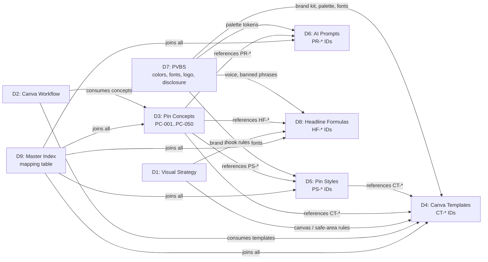
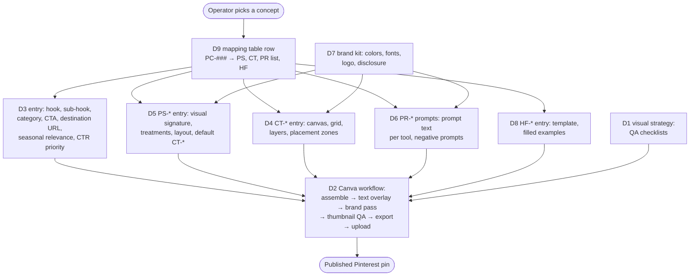

# Design Document

## Overview

The Pinterest Pin Production System (PPPS) is a documentation deliverable, not a software feature. This design specifies the document architecture, file layout, identifier conventions, and cross-document data model that nine markdown deliverables share so the Operator (a non-designer producing pins in Canva for summerfindslab.com) can move from concept to published Pinterest pin without re-deciding any visual or strategic question.

The design treats the deliverable set as a small, file-backed knowledge base. Each document plays one role and exposes a stable set of identifiers (Pin Style IDs, Canva template IDs, AI prompt category IDs, headline formula IDs, pin concept IDs). The master index document holds the single canonical mapping table that joins those identifiers into one row per pin concept, satisfying Requirement 10's referential integrity.

Two outcomes drive every design decision:

1. **Maximum Pinterest organic distribution** — saves, impressions, outbound clicks. This is encoded in the visual strategy document, the styles document, and the headline formulas document.
2. **Maximum affiliate CTR to summerfindslab.com** — every pin concept resolves to a real, indexable destination URL pattern on the brand site, with a documented CTA block and disclosure footer.

The system is designed for the 2026 Pinterest algorithm and creator best practices: mobile-first composition, Thumbnail Zone hook placement, Mobile-Safe Area enforcement, and Pinterest-native (not Instagram-style or Facebook-ad-style) editorial layouts.

### Research notes informing this design

- **Pinterest pin format** — the canonical standard pin canvas is 1000×1500 px (2:3); Idea Pins and video pins use 1080×1920 (9:16). Pinterest's mobile feed thumbnail width is approximately 236 px, which is why Requirement 2 mandates a "scroll-stop test" at that width.
- **Thumbnail Zone behavior** — Pinterest crops the top portion of pins in some feed surfaces and in board previews; placing the primary hook in the top 40% maximizes the chance the hook is visible before tap-expand.
- **Mobile-Safe Area** — Pinterest's various surfaces (related pins, board covers, Lens results) crop pins differently. Keeping critical content within the central 80% prevents text loss across surfaces.
- **Save and CTR drivers** — utility framing (lists, how-tos), curiosity gaps, number-driven headlines, and aspirational lifestyle context are repeatedly identified as save-rate and CTR drivers for Pinterest.
- **Affiliate disclosure** — Pinterest expects affiliate disclosure on pins that lead to affiliate-monetized destinations. The PVBS bakes a disclosure footer into every template.
- **AI image tooling** — Midjourney, Flux, Ideogram, and Nano Banana each have different prompt grammars; the AI prompt library documents tool-specific syntax variants for the same underlying prompt.

These findings are summarized here rather than in separate research files, per the workflow.

---

## Architecture

### Deliverables directory

All nine deliverable documents live under a single, stable directory:

```
.kiro/deliverables/pinterest-pin-production-system/
```

Rationale:

- `.kiro/deliverables/` separates the operator-facing deliverable artifacts from `.kiro/specs/` (which holds requirements, design, and tasks) and from `.kiro/steering/` (which holds always-on rules).
- Naming the subfolder `pinterest-pin-production-system` matches the spec ID, so the deliverables directory is unambiguously linked to this spec.
- Keeping all nine documents in one folder lets cross-document relative links (`./pin-styles.md`) work in any markdown viewer, satisfying Requirement 1.5 (portability).

### File layout

```
.kiro/deliverables/pinterest-pin-production-system/
├── README.md                          # Master index (Doc D9)
├── pin-visual-strategy.md             # Doc D1
├── canva-production-workflow.md       # Doc D2
├── pin-concepts.md                    # Doc D3 (50 viral pin concepts)
├── canva-template-recommendations.md  # Doc D4
├── pin-styles.md                      # Doc D5
├── ai-image-prompts.md                # Doc D6
├── pinterest-visual-branding-system.md # Doc D7
├── headline-formula-library.md        # Doc D8
└── appendix-deprecated.md             # Optional: deprecated assets (Req 13.6)
```

The master index uses the filename `README.md` so it renders as the default landing view in any markdown-aware tool (GitHub, VS Code, Kiro). The other eight documents use kebab-case filenames that match their content.

### Document role map

| Doc ID | Filename | Primary role | Owns identifiers |
|---|---|---|---|
| D1 | `pin-visual-strategy.md` | Why each pin is built the way it is. Mobile-first canvas rules, Thumbnail Zone, Mobile-Safe Area, save/click/curiosity rules. | — |
| D2 | `canva-production-workflow.md` | How the Operator produces pins in Canva. Step-by-step pipeline, batch workflow, export settings, upload metadata. | — |
| D3 | `pin-concepts.md` | What to produce. 50 ready-to-execute pin concepts. | Pin concept IDs (`PC-001` … `PC-050`) |
| D4 | `canva-template-recommendations.md` | Reproducible Canva template specifications, typography system, grid, spacing, brand kit. | Canva template IDs (`CT-MIN-001` …) |
| D5 | `pin-styles.md` | At least seven pin styles with visual signature, typography, layout, when to use. | Pin Style IDs (`PS-MIN`, `PS-TIK`, `PS-LUX`, `PS-VIR`, `PS-COL`, `PS-BAA`, `PS-LST`, …) |
| D6 | `ai-image-prompts.md` | At least 60 AI image prompts in three categories. | AI prompt category IDs (`PR-COLLAGE`, `PR-LIFESTYLE`, `PR-SUMMER`) and per-prompt IDs (`PR-COLLAGE-001`) |
| D7 | `pinterest-visual-branding-system.md` | Brand color palette, font pairing, logo rules, disclosure footer, accessibility minimums. | Color tokens (`brand.sun`, `brand.sand`, etc.), font tokens (`type.display`, `type.body`) |
| D8 | `headline-formula-library.md` | At least 20 reusable headline formulas plus sub-hook and CTA patterns. | Headline formula IDs (`HF-NUM-001`, `HF-CUR-001`, …) |
| D9 | `README.md` | Master index, quick start, version, changelog, mapping table. | — (consumes all other identifiers) |

### Information flow between documents



D7 (PVBS) is the upstream root of the brand: every other document downstream references its color and font tokens. D3 (Pin Concepts) is the integration point — every concept declares its Pin Style, Canva template, AI prompt categories, and headline formula. D9 (Master Index) is where the join is materialized as a single mapping table.

### Single source of truth principle

Each canonical fact lives in exactly one document and is referenced by ID elsewhere:

- Canvas sizes, Thumbnail Zone, Mobile-Safe Area: defined in D1, referenced by D4, D5, D6, D7.
- Color palette and font pairing: defined in D7, referenced by D4, D5, D6.
- Pin Styles: defined in D5, referenced by D3, D4, D8, D9.
- Canva templates: defined in D4, referenced by D5, D3, D9.
- AI prompt categories: defined in D6, referenced by D3, D9.
- Headline formulas: defined in D8, referenced by D3, D9.
- Pin concepts: defined in D3, joined in D9.

If a fact appears in two documents, one is the definition and the other quotes the ID. This is the rule that makes Requirement 10 enforceable.

---

## Components and Interfaces

Each document is a "component" with a defined structure, a public interface (the IDs and tokens it exposes), and a contract with the documents that depend on it.

### D1: `pin-visual-strategy.md`

**Purpose.** The "why" document. The Operator reads this once, then refers back to it when uncertain about a composition decision.

**Sections (H2):**

1. What this is and when to use it (Req 11.1)
2. Canonical canvas sizes
   - Standard pin: 1000×1500 px (2:3)
   - Idea / video pin: 1080×1920 px (9:16)
3. Thumbnail Zone (top 40% / top 600 px)
4. Mobile-Safe Area (central 80%)
5. Seven save-maximization rules (Req 2.5)
6. Seven click-maximization rules (Req 2.6)
7. Five curiosity-maximization patterns (Req 2.7)
8. Mobile-first rules (min font 80 px, min stroke/contrast, max 12 hook words)
9. Native-to-Pinterest design principle
10. Thumbnail optimization checklist
11. The 236 px scroll-stop test

**Public interface:** named constants the rest of the system references — canvas widths, the 40% Thumbnail Zone fraction, the 80% Mobile-Safe Area fraction, minimum hook font size (80 px), and maximum hook word count (12).

### D2: `canva-production-workflow.md`

**Purpose.** The "how" document. Operator-facing, step-by-step.

**Sections:**

1. What this is and when to use it
2. Pre-batch checklist
3. Master Canva template structure (canvas, grid, layer naming, locked layers, editable layers)
4. Eight-stage content pipeline: concept intake → image sourcing → Canva assembly → text overlay → brand pass → thumbnail QA → export → upload metadata
5. Step-by-step single-pin workflow
6. Batch production workflow (10–25 pins per session, ≥10 pins / 60 min)
7. Variant scaling pattern (3 thumbnail variants, 2 color variants per concept via duplicate page)
8. Canva export settings (PNG, 1000×1500, RGB)
9. File-naming convention for exported pins (encodes pin style, concept ID, date — see "Identifier Conventions" below)
10. Post-export QA checklist
11. Pinterest upload metadata templates (pin title, description, alt text, destination URL, board)

**Public interface:** the file-naming pattern (depends on D3 and D5 IDs), the export setting block, and the upload metadata template.

### D3: `pin-concepts.md`

**Purpose.** The 50-row catalog of pin concepts — the production backlog.

**Sections:**

1. What this is and when to use it
2. How to read a concept entry (field-by-field guide)
3. Concept distribution summary (by category, by Pin Style, by emotional trigger, by CTR priority)
4. The 50 concepts (one entry per concept, grouped by category; entries indexed `PC-001` through `PC-050`)
5. Index by emotional trigger
6. Index by Pin Style
7. Index by season

**Per-concept entry schema** — every entry contains every field below; no field may be empty:

```
PC-### — <Concept title>
  Hook (primary text overlay):       <string, ≤12 words>
  Sub-hook (secondary line):         <string>
  Target product category:           one of: summer-finds, viral-gadgets,
                                     beach-essentials, tiktok-products,
                                     travel-accessories, aesthetic-products
  Pin Style ID:                      PS-<CODE>      (must exist in D5)
  Canva template ID:                 CT-<CODE>-### (must exist in D4)
  Layout pattern:                    <string referencing D5 layout>
  Emotional trigger:                 one of: curiosity, FOMO, aspiration,
                                     social-proof, discovery
  AI prompt category IDs:            [PR-CATEGORY, …]  (1–5 entries, each in D6)
  Headline formula ID:               HF-<GROUP>-### (must exist in D8)
  CTA block text:                    <string>
  Destination URL pattern:           https://summerfindslab.com/<path>
  CTR priority:                      one of: high, medium, exploratory
  Seasonal relevance:                ordered list of months (1–12)
```

**Public interface:** the 50 IDs `PC-001` … `PC-050` and their joined identifier set.

### D4: `canva-template-recommendations.md`

**Purpose.** Reproducible Canva template specifications.

**Sections:**

1. What this is and when to use it
2. Canva Brand Kit specification (see "Brand Kit for Canva" below)
3. Typography system (display, body, accent — all native in Canva)
4. Font sizes in px at 1000×1500: primary hook (80–180), secondary hook, product label, price tag, CTA block, disclosure
5. 12-column grid (column width, gutter)
6. Spacing tokens (xs, sm, md, lg, xl) and their semantic uses
7. Mobile-first visual rules (4.5:1 contrast minimum for primary hook, 48 px min edge padding, 30% max text density)
8. Layer stack convention (bottom → top: background → image → image-treatments → headline → sub-hook → CTA → logo → disclosure)
9. The seven (or more) Canva-reproducible layout templates — one per Pin Style
10. Locked layers principle

**Per-template entry schema:**

```
CT-<STYLE-CODE>-### — <Template name>
  Backing Pin Style:           PS-<CODE>     (must exist in D5)
  Canvas:                      1000×1500 px (or 1080×1920 for Idea/video)
  Grid:                        12-col, gutter <px>, column width <px>
  Layer stack (bottom → top):  …
  Text placement zones:        …
  Image placement zones:       …
  CTA block placement:         …
  Disclosure placement:        …
  Canva element types per layer: …
```

**Public interface:** Canva template IDs (`CT-MIN-001`, `CT-TIK-001`, …). At minimum one template per Pin Style; multiple templates per style allowed.

### D5: `pin-styles.md`

**Purpose.** The visual style families.

**Sections:**

1. What this is and when to use it
2. The seven required styles, each with the schema below
3. Hybrid combinations (≥3, e.g., Luxury Summer + List)
4. Styles-by-category matrix

**Per-style entry schema:**

```
PS-<CODE> — <Style name>
  Visual signature:            <prose>
  Color treatment:             <references brand tokens from D7>
  Typography treatment:        <references font tokens from D7>
  Layout pattern:              <prose>
  Image treatment:             <prose>
  Text overlay rules:          <prose>
  When to use:                 <bullets>
  When NOT to use:             <bullets>
  Three example pin titles:    <list>
  Default Canva template ID:   CT-<CODE>-001  (must exist in D4)
```

**Required style IDs (Req 6.1):**

| ID | Style |
|---|---|
| `PS-MIN` | Minimal Aesthetic |
| `PS-TIK` | TikTok-Style |
| `PS-LUX` | Luxury Summer Vibe |
| `PS-VIR` | Viral Amazon Finds |
| `PS-COL` | Product Collage |
| `PS-BAA` | Before/After |
| `PS-LST` | List-Style |

**Public interface:** the seven `PS-*` IDs and the `Default Canva template ID` field on each (which back-references D4).

### D6: `ai-image-prompts.md`

**Purpose.** ≥60 AI image prompts in three categories, with tool-specific variants.

**Sections:**

1. What this is and when to use it
2. Prompt structure template (subject, environment, lighting, color palette, style references, mood, framing, aspect ratio)
3. The three prompt categories (each is also an ID):
   - `PR-COLLAGE` — Product collage prompts (≥20)
   - `PR-LIFESTYLE` — Lifestyle aesthetic prompts (≥20)
   - `PR-SUMMER` — Summer aesthetic prompts (≥20)
4. Tool-specific syntax variants (Midjourney, Flux, Ideogram, Nano Banana)
5. Negative prompt patterns (text artifacts, watermarks, unrealistic anatomy, brand logos)
6. Prompt sub-types (each prompt belongs to its category and may also carry a sub-tag):
   - ≥5 lifestyle scene prompts (beach, poolside, travel, aesthetic interior)
   - ≥5 product hero prompts
   - ≥5 aesthetic flatlay prompts (linen, sand, marble, terrazzo)
7. Prohibited prompt patterns (real people, copyrighted characters, named brand products)

**Per-prompt entry schema:**

```
PR-<CATEGORY>-### — <Short title>
  Category ID:                 PR-COLLAGE | PR-LIFESTYLE | PR-SUMMER
  Intended use case:           <prose>
  Target Pin Style ID:         PS-<CODE>     (must exist in D5)
  Recommended tool(s):         midjourney | flux | ideogram | nano-banana | dall-e
  Recommended aspect ratio:    2:3 | 9:16 | 1:1 | …
  Prompt text (Midjourney):    <code block>
  Prompt text (Flux):          <code block>
  Prompt text (Ideogram):      <code block>
  Prompt text (Nano Banana):   <code block>
  Negative prompts:            <list>
  Post-processing notes:       <prose>
```

**Public interface:** the three category IDs (`PR-COLLAGE`, `PR-LIFESTYLE`, `PR-SUMMER`) — these are what D3 references — and the per-prompt IDs.

### D7: `pinterest-visual-branding-system.md`

**Purpose.** The brand. Upstream root that everything visual references.

**Sections:**

1. What this is and when to use it
2. Primary color palette (≥6 colors with hex and role)
3. Secondary / seasonal palette (≥4 colors)
4. Color role table (background, primary text, accent, CTA, divider, disclosure)
5. Font pairing (1 display, 1 body, both native in Canva)
6. Font role table (primary hook, secondary hook, product label, CTA, disclosure)
7. Logo usage rules (placement zones, min size, clearspace, prohibited treatments)
8. Thumbnail optimization rules (min text contrast, max hook word count, min hook font size, Thumbnail Zone composition)
9. Brand voice for on-pin text (warm, confident, discovery-driven; no hype words like "INSANE")
10. Disclosure footer pattern (size, placement, color)
11. Accessibility minimum (4.5:1 contrast for primary hook)
12. Do/don't gallery (≥5 examples for color, typography, layout)
13. How brand visuals vary across the seven Pin Styles while staying recognizably summerfindslab

**Public interface:** color tokens, font tokens, disclosure footer spec, logo placement spec.

### D8: `headline-formula-library.md`

**Purpose.** Reusable text-overlay patterns.

**Sections:**

1. What this is and when to use it
2. The four formula categories (each prefix is the ID stem):
   - `HF-NUM` — number-driven
   - `HF-CUR` — curiosity gap
   - `HF-SOC` — social proof
   - `HF-ASP` — aspirational
3. ≥20 formulas total, ≥1 per category, distributed for variety
4. ≥5 sub-hook patterns
5. ≥5 CTA block patterns
6. Pinterest-prohibited phrase list (≥10 phrases) — Req 9.6 / 12.1
7. Headline evaluation checklist (brand voice + CTR)

**Per-formula entry schema:**

```
HF-<GROUP>-### — <Formula name>
  Group:                       NUM | CUR | SOC | ASP
  Template (with placeholders): "[N] [Category] Under $[Price] That Look [Adjective]"
  Emotional trigger:           one of: curiosity, FOMO, aspiration,
                               social-proof, discovery
  Recommended Pin Style IDs:   [PS-…, …]   (each must exist in D5)
  Three filled examples:       <list>
  Do not use when:             <prose>
```

**Public interface:** the formula IDs `HF-NUM-###`, `HF-CUR-###`, `HF-SOC-###`, `HF-ASP-###`.

### D9: `README.md` (master index)

**Purpose.** Landing page, quick start, version, changelog, and the canonical mapping table.

**Sections:**

1. What this is and when to use it
2. Version (`v1.0`) and changelog
3. The nine deliverables — one paragraph each, with relative link
4. Quick start: produce a first pin in 30 minutes
5. **Mapping table** — exactly 50 rows, one per pin concept (Req 10.6)
6. Seasonal refresh checklist (spring, summer, fall, winter)
7. Versioning policy (MAJOR for Pinterest policy changes; MINOR for new style/formula/prompt/concept)
8. Deprecated pattern (link to `appendix-deprecated.md`)
9. Validation report block — output of the integrity check (see Error Handling)

The mapping table columns are exactly:

| `Concept ID` | `Pin Style ID` | `Canva Template ID` | `AI Prompt Category IDs` | `Headline Formula ID` |

with 50 rows and no empty cells (Req 10.6).

---

## Data Models

The deliverables are markdown, but the cross-document relations behave like a small relational schema. Documenting that schema explicitly is what makes Requirement 10 testable.

### Identifier Conventions

All identifiers use uppercase ASCII with `-` separators and a numeric suffix where multiple instances of the same kind exist. Identifiers are stable: once an ID is assigned, it is never reassigned to a different asset; retired assets move to `appendix-deprecated.md` (Req 13.6).

| Entity | ID pattern | Example | Defined in |
|---|---|---|---|
| Pin concept | `PC-###` (zero-padded, 001–050) | `PC-001` | D3 |
| Pin Style | `PS-<CODE>` (3-letter code) | `PS-MIN` | D5 |
| Canva template | `CT-<STYLE-CODE>-###` | `CT-MIN-001` | D4 |
| AI prompt category | `PR-<CATEGORY>` | `PR-COLLAGE` | D6 |
| AI prompt (individual) | `PR-<CATEGORY>-###` | `PR-COLLAGE-001` | D6 |
| Headline formula | `HF-<GROUP>-###` | `HF-NUM-001` | D8 |
| Color token | `brand.<name>` | `brand.sun` | D7 |
| Font token | `type.<role>` | `type.display` | D7 |
| Spacing token | `space.<size>` | `space.md` | D4 |

The Canva template ID encodes the Pin Style code so that template membership in a style is visible from the ID alone, without needing to read the entry. This is also what the Canva file-naming convention (D2) consumes.

**Canva export filename pattern (D2):**

```
<PC-ID>__<PS-ID>__<CT-ID>__YYYY-MM-DD__v<n>.png

example: PC-014__PS-LUX__CT-LUX-002__2026-05-28__v1.png
```

### Canonical Visual Specifications

These are constants referenced by D4, D5, D6, D7 and validated against in D2's QA checklist. They are defined once in D1.

| Spec | Value |
|---|---|
| Standard pin canvas | 1000×1500 px (2:3) |
| Idea / video pin canvas | 1080×1920 px (9:16) |
| Thumbnail Zone | top 40% (top 600 px of a 1500 px pin) |
| Mobile-Safe Area | central 80% of canvas |
| Min primary hook font size | 80 px (at 1000×1500) |
| Max primary hook font size | 180 px |
| Max words in primary hook | 12 |
| Min text contrast (primary hook) | 4.5:1 |
| Min text padding from canvas edge | 48 px |
| Max text density | 30% of canvas area |
| Pinterest mobile feed thumbnail width | 236 px (scroll-stop test reference) |
| Min batch size | 10 pins |
| Target batch throughput | ≥10 pins / 60 min |

### Brand Kit for Canva (D7 → uploaded into Canva Brand Kit)

The Canva Brand Kit holds: hex codes for every color token, the display and body font assets, and the logo files. The PVBS document defines the upload checklist; D4 references the Brand Kit by token name.

```
Color tokens (≥6 primary, ≥4 seasonal):
  brand.sun        #<hex>     warm sun tone     role: accent / CTA hover
  brand.sand       #<hex>     sand / cream      role: background neutral
  brand.ocean      #<hex>     ocean accent      role: secondary accent
  brand.sunset     #<hex>     sunset accent     role: gradient endpoint
  brand.deep       #<hex>     deep contrast     role: primary text on light
  brand.cta        #<hex>     bright CTA        role: CTA block
  ... (seasonal: brand.spring, brand.fall, brand.winter, brand.poolside, …)

Font tokens (Canva-native):
  type.display     <font name>   role: primary hook, secondary hook
  type.body        <font name>   role: product label, sub-hook, CTA, disclosure
  type.accent      <font name>   role: optional accent / numerals

Logo assets:
  logo.primary     <file ref>    color: brand.deep on brand.sand
  logo.inverse     <file ref>    color: brand.sand on brand.deep
  logo.mark        <file ref>    monogram only
```

### Production Pipeline Data Flow

The pipeline below is the operator-facing version of the same flow shown in the Information Flow diagram, expressed as data passing between documents.



The Operator's interaction always starts at D9 (the mapping table), reads downstream documents by ID, and ends at D2 (the workflow that produces the artifact).

### Cross-Document Referential Integrity Model

This is the data model that Requirement 10 enforces. Every cross-reference is a foreign key. There are five foreign-key relations:

| FK # | Source field | Source doc | Must reference an ID in | Target doc | Cardinality |
|---|---|---|---|---|---|
| FK1 | `Pin Style ID` on a concept | D3 | `PS-*` IDs | D5 | exactly 1 per concept |
| FK2 | `Canva template ID` on a concept | D3 | `CT-*` IDs | D4 | exactly 1 per concept |
| FK3 | `AI prompt category IDs` on a concept | D3 | `PR-*` category IDs | D6 | 1 to 5 per concept |
| FK4 | `Headline formula ID` on a concept | D3 | `HF-*` IDs | D8 | exactly 1 per concept |
| FK5 | `Default Canva template ID` on a Pin Style | D5 | `CT-*` IDs | D4 | exactly 1 per style |

The mapping table in D9 is a materialized view of the join D3 ⋈ D5 ⋈ D4 ⋈ D6 ⋈ D8, with one row per `PC-###`. Requirement 10.6 mandates exactly 50 rows and no empty cells, which is the integrity check restated as a query:

```
For every PC-### in D3:
  pin_style_id      ∈ {PS-* defined in D5}      (FK1, non-empty)
  canva_template_id ∈ {CT-* defined in D4}      (FK2, non-empty)
  ai_prompt_cats    ⊆ {PR-* categories in D6} ∧ 1 ≤ |ai_prompt_cats| ≤ 5  (FK3)
  headline_formula  ∈ {HF-* defined in D8}      (FK4, non-empty)
```

Any violation produces a validation error entry of the form (Req 10.5):

```
{ concept_id: "PC-###", asset_type: "<one of: pin_style|canva_template|ai_prompt_category|headline_formula>",
  invalid_value: "<the bad/empty value>", reason: "<missing|not-defined-in-source-doc|out-of-range>" }
```

Validation errors are emitted into the "Validation report block" at the end of D9 (README). A pin concept with at least one validation error is not "ready for the production phase tasks" (Req 10.5).

### Distribution and Cardinality Invariants

Beyond foreign keys, the deliverables have several universal invariants that are testable without running any code.

| Invariant | Source requirement |
|---|---|
| `\|D3.concepts\| == 50` | Req 4.1 |
| Every brand category has ≥5 concepts in D3 | Req 4.4 |
| ≥6 distinct headline formula IDs are referenced across D3 | Req 4.5 |
| ≥5 distinct emotional triggers are referenced across D3 | Req 4.6 |
| Every Pin Style defined in D5 is used by ≥3 concepts in D3 | Req 4.8 |
| `\|D5.styles\| ≥ 7` and includes `{PS-MIN, PS-TIK, PS-LUX, PS-VIR, PS-COL, PS-BAA, PS-LST}` | Req 6.1 |
| `\|D6.prompts\| ≥ 60`, with ≥20 in each of the 3 categories | Req 7.1, 7.2 |
| D6 includes ≥5 lifestyle scene, ≥5 product hero, ≥5 aesthetic flatlay prompts | Req 7.9, 7.10, 7.11 |
| Tool-specific syntax variants exist for Midjourney, Flux, Ideogram, Nano Banana on every D6 prompt | Req 7.4 |
| `\|D7.primary palette\| ≥ 6` and `\|D7.seasonal palette\| ≥ 4` | Req 8.1, 8.2 |
| `\|D8.formulas\| ≥ 20` covering NUM, CUR, SOC, ASP | Req 9.1, 9.3 |
| D8 prohibited-phrase list has ≥10 phrases | Req 12.1 |
| Every concept's `Destination URL` matches `https://summerfindslab.com/...` | Req 12.6 |
| Every D6 prompt's negative-prompt list excludes real people / named brand products | Req 7.12, 12.7 |
| D9 mapping table has exactly 50 rows and no empty cells | Req 10.6 |

These are the universal "for all" statements that the Correctness Properties section will formalize.

---

<!-- Correctness Properties section follows the prework analysis -->

## Correctness Properties

*A property is a characteristic or behavior that should hold true across all valid executions of a system — essentially, a formal statement about what the system should do. Properties serve as the bridge between human-readable specifications and machine-verifiable correctness guarantees.*

PPPS is a documentation deliverable, but the cross-document references, distribution requirements, and cardinality thresholds in the requirements form a small relational schema with universal invariants. Each property below is a "for all" statement over the deliverable set. They are validated by a lightweight integrity check (described in Testing Strategy) that parses the markdown deliverables, extracts the structured fields, and asserts each property across all entries — exactly the shape of property-based testing applied to a knowledge base rather than to runtime code.

### Property 1: Deliverable set integrity

*For all* valid PPPS deliverable directories, the set of markdown files in the deliverables directory SHALL exactly equal the canonical set `{README.md, pin-visual-strategy.md, canva-production-workflow.md, pin-concepts.md, canva-template-recommendations.md, pin-styles.md, ai-image-prompts.md, pinterest-visual-branding-system.md, headline-formula-library.md}` (with the optional addition of `appendix-deprecated.md`).

**Validates: Requirements 1.1, 1.2**

### Property 2: Cross-document referential integrity

*For all* foreign-key references in the deliverable set — every concept's Pin Style ID (FK1), every concept's Canva Template ID (FK2), every AI prompt category ID listed on a concept (FK3), every concept's Headline Formula ID (FK4), and every Pin Style's Default Canva Template ID (FK5) — the referenced identifier SHALL be non-empty AND SHALL exactly match an identifier defined in its target document.

**Validates: Requirements 10.1, 10.2, 10.3, 10.4**

### Property 3: Mapping table completeness

*For all* materializations of the master index mapping table, the table SHALL contain exactly 50 rows (one per pin concept), SHALL have exactly the columns `Concept ID`, `Pin Style ID`, `Canva Template ID`, `AI Prompt Category IDs`, `Headline Formula ID`, SHALL have no empty cells in any row, and SHALL have every cell value match a defined identifier in its source document.

**Validates: Requirements 10.6**

### Property 4: Validation error coverage

*For all* foreign-key violations detected by Property 2, there SHALL exist a corresponding entry in D9's validation report block whose `concept_id`, `asset_type`, and `invalid_value` fields identify that violation, and the corresponding pin concept SHALL not be marked ready for production tasks.

**Validates: Requirements 10.5**

### Property 5: Concept entry completeness

*For all* pin concept entries `PC-001` through `PC-050` in D3, every required field SHALL be non-empty, AND each field whose value is drawn from a fixed set (`Target product category`, `Emotional trigger`, `CTR priority`) SHALL have a value in that set.

**Validates: Requirements 4.2, 4.9, 4.10**

### Property 6: Concept distribution

*For all* valid pin concept catalogs in D3, the concepts SHALL partition by `Target product category` into the six brand categories `{summer-finds, viral-gadgets, beach-essentials, tiktok-products, travel-accessories, aesthetic-products}`, every category SHALL contain at least 5 concepts, the set of distinct headline formula IDs referenced across the 50 concepts SHALL have size ≥ 6, and the set of distinct emotional triggers SHALL have size ≥ 5.

**Validates: Requirements 4.3, 4.4, 4.5, 4.6**

### Property 7: Pin Style usage minimum

*For all* Pin Style identifiers `PS-*` defined in D5, the count of pin concepts in D3 whose `Pin Style ID` equals that identifier SHALL be ≥ 3.

**Validates: Requirements 4.8**

### Property 8: Style and template entry completeness

*For all* Pin Style entries in D5 and *for all* Canva template entries in D4, every required field defined in the per-entry schema SHALL be non-empty, including (for templates) the layer stack, text and image placement zones, CTA block placement, disclosure placement, and the Canva element type assigned to each layer.

**Validates: Requirements 5.8, 5.9, 6.2, 11.6**

### Property 9: Style → Template coverage

*For all* Pin Style identifiers `PS-*` defined in D5, there SHALL exist at least one Canva template entry in D4 whose backing Pin Style equals that identifier.

**Validates: Requirements 5.7**

### Property 10: AI prompt entry completeness

*For all* AI prompt entries `PR-<CATEGORY>-###` in D6, every required field SHALL be non-empty, AND the `Prompt text` block SHALL include a tool-specific variant for each of `midjourney`, `flux`, `ideogram`, and `nano-banana`.

**Validates: Requirements 7.3, 7.4**

### Property 11: AI prompt safety

*For all* AI prompt entries in D6, the prompt text SHALL NOT request likenesses of real people, copyrighted characters, or named branded products, AND the prompt's negative-prompt list SHALL include patterns that exclude text/typography artifacts, watermarks, unrealistic anatomy, and brand logos.

**Validates: Requirements 7.8, 7.12, 12.7**

### Property 12: Headline formula entry completeness

*For all* headline formula entries `HF-*` in D8, every required field SHALL be non-empty, AND each formula SHALL include at least 3 filled examples.

**Validates: Requirements 9.2, 11.6**

### Property 13: Prohibited phrase compliance

*For all* concept hooks, sub-hooks, and CTA blocks in D3 and *for all* filled examples in headline formulas in D8, the text SHALL NOT contain any phrase listed in D8's prohibited-phrase list.

**Validates: Requirements 9.6, 12.1, 12.5**

### Property 14: Destination URL pattern

*For all* pin concept entries in D3, the `Destination URL pattern` SHALL begin with `https://summerfindslab.com/` and SHALL NOT route through any link shortener domain (e.g., `bit.ly`, `t.co`, `lnk.to`, `s.click.aspx`).

**Validates: Requirements 12.6**

### Property 15: Price reference convention

*For all* price references appearing in any concept's hook, sub-hook, or CTA text in D3, the price reference SHALL match the generic price-tier pattern (e.g., `Under $25`, `Under $50`, `Under $100`) and SHALL NOT be a hard fixed price (e.g., `$23.99`, `$48.50`).

**Validates: Requirements 4.7**

### Property 16: Minimum cardinality table

*For all* deliverable sections governed by a cardinality requirement, the count of entries SHALL meet or exceed its minimum, where the cardinality table is:

| Section | Minimum |
|---|---|
| D1 save-maximization rules | 7 |
| D1 click-maximization rules | 7 |
| D1 curiosity-maximization patterns | 5 |
| D5 distinct Pin Styles (and contains all of `PS-MIN, PS-TIK, PS-LUX, PS-VIR, PS-COL, PS-BAA, PS-LST`) | 7 |
| D5 hybrid combinations | 3 |
| D6 prompts total | 60 |
| D6 prompts in `PR-COLLAGE` | 20 |
| D6 prompts in `PR-LIFESTYLE` | 20 |
| D6 prompts in `PR-SUMMER` | 20 |
| D6 lifestyle scene prompts | 5 |
| D6 product hero prompts | 5 |
| D6 aesthetic flatlay prompts | 5 |
| D7 primary palette colors | 6 |
| D7 seasonal palette colors | 4 |
| D7 do/don't gallery examples | 5 |
| D8 headline formulas | 20 |
| D8 sub-hook patterns | 5 |
| D8 CTA block patterns | 5 |
| D8 prohibited phrases | 10 |

**Validates: Requirements 2.5, 2.6, 2.7, 6.1, 6.11, 7.1, 7.2, 7.9, 7.10, 7.11, 8.1, 8.2, 8.7, 9.1, 9.4, 9.5, 12.1**

### Property 17: File-naming convention

*For all* example exported pin filenames appearing in D2, the filename SHALL match the pattern `PC-\d{3}__PS-[A-Z]+__CT-[A-Z]+-\d{3}__\d{4}-\d{2}-\d{2}__v\d+\.png`, AND every `PC-`, `PS-`, and `CT-` token in the filename SHALL reference a defined identifier in D3, D5, and D4 respectively.

**Validates: Requirements 3.6**

### Property 18: Document structure invariants

*For all* deliverable documents in the deliverables directory, the document SHALL contain exactly one H1, the body immediately following the H1 SHALL be a single-paragraph "what this is and when to use it" summary, the document SHALL contain a table-of-contents section if and only if its line count exceeds 500, and every per-entry block in D4 (templates), D6 (prompts), and D8 (formulas) SHALL be presented as a code block or markdown table.

**Validates: Requirements 11.1, 11.2, 11.3, 11.4**

### Property 19: Jargon definition

*For all* occurrences of design-jargon terms in any deliverable — specifically the words `kerning`, `leading`, and `tracking` — the first occurrence in each deliverable SHALL be followed within 30 words by a parenthetical plain-language definition.

**Validates: Requirements 11.5**

### Property 20: Cross-deliverable links are relative

*For all* markdown links in any deliverable whose target filename matches another deliverable in the directory, the link target SHALL be a relative path (e.g., `./pin-styles.md`) and SHALL NOT be an absolute URL.

**Validates: Requirements 1.5**

### Property 21: Master index link coverage

*For all* deliverable filenames other than `README.md`, the master index `README.md` SHALL contain at least one relative markdown link whose target is that filename.

**Validates: Requirements 1.4**

### Property 22: Color token role completeness

*For all* color tokens defined in D7's primary and seasonal palettes, the token entry SHALL have a non-empty `role` field whose value is from the documented role set `{background, primary text, accent, CTA, divider, disclosure}` (or a documented superset).

**Validates: Requirements 8.3**

### Property 23: ID stability

*For all* identifiers ever referenced anywhere in the deliverable set, that identifier SHALL be defined in either an active deliverable document or in `appendix-deprecated.md`. No identifier SHALL be silently removed; retired identifiers SHALL move to the deprecated appendix.

**Validates: Requirements 13.6**

### Property 24: Changelog entry completeness

*For all* changelog entries in D9, the entry SHALL contain a non-empty `date`, `version` (matching `v\d+\.\d+`), and `summary` field.

**Validates: Requirements 13.2**

---

## Error Handling

The deliverable set has no runtime, so "error handling" here means how the integrity check behaves when a deliverable is malformed, and how validation findings are surfaced to the Operator.

### Validation report block

The master index document `README.md` ends with a `## Validation Report` section. It contains either the line `OK — no validation errors` or a markdown table with one row per error:

| Concept ID | Asset Type | Invalid Value | Reason |
|---|---|---|---|
| `PC-014` | `pin_style` | `PS-LUXX` | `not-defined-in-source-doc` |
| `PC-027` | `headline_formula` | `(empty)` | `missing` |

`Asset Type` ∈ `{pin_style, canva_template, ai_prompt_category, headline_formula}`.

`Reason` ∈ `{missing, not-defined-in-source-doc, out-of-range}` (where `out-of-range` covers FK3 cardinality 1–5).

This realizes Requirement 10.5: the moment any FK fails, the concept is recorded in the validation report and is treated as not ready for production.

### Failure modes and operator responses

| Failure mode | Detection | Operator response |
|---|---|---|
| Concept references a `PS-*` not in D5 | Property 2 | Update the concept's `Pin Style ID` to a defined style, or define the new style in D5 (and bump MINOR version per Req 13.5). |
| Concept references a `CT-*` not in D4 | Property 2 | Same shape as above against D4. |
| Concept lists 0 or >5 AI prompt categories | Property 2 | Bring the count into the 1..5 range. |
| Mapping table row has an empty cell | Property 3 | Fill the cell with a defined identifier. |
| `pin-concepts.md` has fewer or more than 50 concepts | Property 6 (cardinality) | Add or retire concepts; if retiring, move to `appendix-deprecated.md`. |
| A concept's destination URL is not on `summerfindslab.com` | Property 14 | Rewrite the destination URL. |
| A concept hook contains a Pinterest-prohibited phrase | Property 13 | Replace the phrase using D8's headline evaluation checklist. |
| An AI prompt requests a real person or named brand | Property 11 | Rewrite the prompt; record in changelog. |
| A document exceeds 500 lines without a TOC | Property 18 | Add the TOC. |
| Cross-deliverable link uses an absolute URL | Property 20 | Rewrite as a relative path. |

### Editorial-only failure modes (not mechanically detected)

Some requirements are quality goals that the integrity check cannot verify (Requirement 1.6 self-containment, Requirement 2.9 native-to-Pinterest principle, Requirement 11.7 quick start producing a first pin in 30 minutes). These are surfaced in a separate `## Editorial Review Checklist` in D9 that the Operator runs before bumping the version.

---

## Testing Strategy

Because the deliverables are markdown documents — not code — the testing strategy is split between (a) a lightweight automated integrity check that validates the cross-document properties listed above and (b) editorial review for quality-only criteria.

### Why property-based testing applies (and what we are not testing)

Property-based testing applies cleanly to the deliverable schema. The 24 properties above are universally quantified statements over the deliverable entries (50 concepts, ≥7 styles, ≥60 prompts, ≥20 formulas, ≥6 colors, etc.). The "input space" is the population of entries, and PBT-shaped checks repeatedly assert the same invariant against every entry and against derived sets.

PBT does **not** apply to:

- The visual quality or aesthetic correctness of any pin produced from the documents — that is editorial / human review.
- Whether a pin actually drives saves or CTR on Pinterest — that is an outcome metric, not a property.
- The semantics of an AI prompt's output image — that is the AI tool's behavior, not our document.
- Pinterest's own behavior (algorithm, downranking) — that is external service behavior.

For those, we rely on editorial review and outcome measurement on the live Pinterest account.

### Integrity check (mechanical, automated)

A small Node.js script lives at `.kiro/deliverables/pinterest-pin-production-system/_check.mjs` (or the project's preferred location). It:

1. Reads all markdown files in the deliverables directory.
2. Parses each document into a structured representation:
   - Pulls every `PC-###`, `PS-*`, `CT-*`, `PR-*`, `HF-*` identifier and its surrounding fields.
   - Reads the mapping table in `README.md`.
   - Reads cardinality-counted sections (rules, prompts, formulas, palette colors).
3. Asserts each of Properties 1–24 across the parsed data.
4. Writes the result back to the `## Validation Report` section in `README.md`.

The script is a property-based check in spirit: each property is implemented once, then iterated over every applicable entry. We use the project's existing test runner (the repo is a Next.js project, so Vitest or Jest is the natural fit) and the [`fast-check`](https://github.com/dubzzz/fast-check) library only where we want to randomize *which* IDs are referenced from a synthetic concept set during regression tests against the parser. For the deliverables themselves, the dataset is the deliverable, not generated.

#### Property test configuration

For the parser-level tests that use `fast-check`:

- Minimum 100 iterations per property test.
- Each test is tagged with a comment in the form **Feature: pinterest-pin-production-system, Property N: \<property text\>**.
- Each correctness property is implemented with a single test (or a single parameterized test where the property iterates a static list, e.g., the cardinality table in Property 16).

#### Test mapping

| Property | Test target |
|---|---|
| P1 Deliverable set integrity | Filesystem listing vs canonical set. |
| P2 Cross-document referential integrity | Iterate every FK across D3, D5; assert target ID set membership. |
| P3 Mapping table completeness | Parse `## Mapping` table in `README.md`; assert 50 rows, no empty cells, FK validity per cell. |
| P4 Validation error coverage | Inject seeded FK violations into a copy of the deliverables; assert validation report contains corresponding entries. (Uses `fast-check` to generate violation sets.) |
| P5 Concept entry completeness | Iterate D3 entries; assert all required fields non-empty + value-set membership. |
| P6 Concept distribution | Group D3 by category; assert partition + per-group ≥5 + ≥6 distinct formulas + ≥5 distinct triggers. |
| P7 Pin Style usage minimum | Iterate D5 styles; assert count of D3 references ≥ 3. |
| P8 Style and template entry completeness | Iterate D5 and D4; assert all required fields non-empty. |
| P9 Style → Template coverage | Iterate D5 styles; assert ≥1 D4 template with backing PS = style. |
| P10 AI prompt entry completeness | Iterate D6; assert required fields non-empty + tool variants present. |
| P11 AI prompt safety | Iterate D6; regex/banned-list scan over prompt text; assert presence of required negative patterns. |
| P12 Headline formula entry completeness | Iterate D8; assert required fields non-empty + ≥3 examples. |
| P13 Prohibited phrase compliance | Iterate D3 and D8 example strings; assert disjoint with prohibited list. |
| P14 Destination URL pattern | Iterate D3 URLs; regex `^https://summerfindslab\.com/` and shortener blacklist. |
| P15 Price reference convention | Iterate D3 text fields; regex `Under \$\d+` allowed, `\$\d+\.\d{2}` disallowed. |
| P16 Minimum cardinality table | Static table iteration; one assertion per row. |
| P17 File-naming convention | Iterate D2 example filenames; regex match + FK resolve. |
| P18 Document structure invariants | Iterate deliverables; H1 count, opening-paragraph presence, conditional TOC, code-block/table presence. |
| P19 Jargon definition | Iterate deliverables; for each jargon term, assert first occurrence is followed within 30 words by `(...)`. |
| P20 Cross-deliverable links are relative | Parse all markdown links; assert no absolute URL targets a deliverable filename. |
| P21 Master index link coverage | Parse `README.md` links; assert every other deliverable filename appears as a relative target. |
| P22 Color token role completeness | Iterate D7 palette tables; assert role non-empty and in role set. |
| P23 ID stability | Build the union of ID definitions across active docs + `appendix-deprecated.md`; assert every referenced ID is in the union. |
| P24 Changelog entry completeness | Iterate D9 changelog entries; assert required fields and `vMAJOR.MINOR` format. |

The integrity check is run:

- On every commit that touches `.kiro/deliverables/pinterest-pin-production-system/**`.
- On demand by the Operator via `npm run check:ppps`.
- As part of the seasonal refresh (Requirement 13.3).

### Editorial review (human, not mechanical)

A `## Editorial Review Checklist` in `README.md` covers the criteria that the integrity check cannot evaluate:

- **Self-containment** (Req 1.6): can the operator use any one document without reading the others?
- **Native-to-Pinterest aesthetic** (Req 2.9): do the example pins look like Pinterest editorial content, not Instagram or Facebook ads?
- **Save/click rule quality** (Req 2.5, 2.6, 2.7): are the rules concrete enough to act on?
- **Brand voice** (Req 8.8): do on-pin texts read warm and discovery-driven without hype words?
- **Quick start** (Req 11.7): can a fresh Operator produce a first pin within 30 minutes?
- **Pinterest 2026 policy alignment** (Req 12.1, 12.2, 12.3, 12.4): is the policy guidance current?

Editorial review is run before any version bump and is recorded in the changelog entry that accompanies the bump.

### Outcome measurement (out of scope for this design)

The brand owner measures actual Pinterest performance — saves, impressions, outbound clicks, affiliate CTR — on the live account. Those metrics inform future seasonal refreshes (which concepts to deprecate, which styles to expand) but are not properties the deliverable set itself can guarantee.
