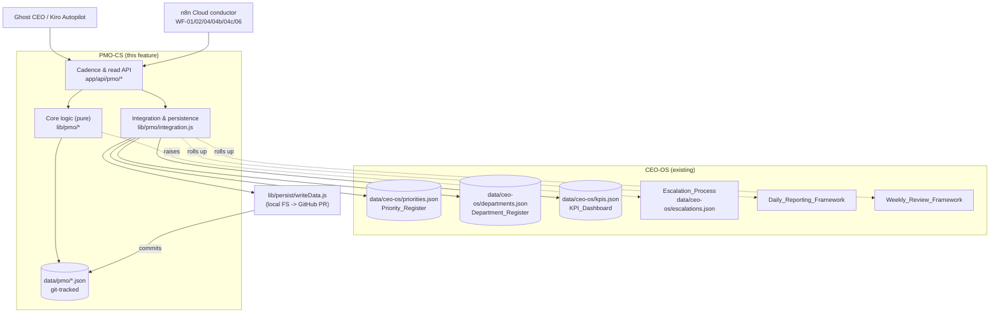

# Design Document

## Overview

The PMO Coordination System (PMO-CS) is the coordination layer through which Ghost Corporation's Project Management Office (PMO) runs cross-department execution for the Summer Finds Lab Daily affiliate engine. It sits **below the Ghost CEO and above the seven Departments**: it ingests CEO-defined Goals from the CEO-OS `Priority_Register`, decomposes them into Tasks, routes each Task to exactly one owning Department, tracks execution through Projects and Milestones, prevents duplicate work, scores and ranks work toward outbound clicks, escalates blockers into the CEO `Escalation_Process`, and rolls progress up into the existing daily and weekly cadences (Requirement 1).

This design is a direct extension of the **CEO Operating System** (`.kiro/specs/ceo-operating-system/design.md`) and reuses its conventions verbatim rather than inventing new ones:

- **All canonical data is git-tracked flat JSON under `data/`** (ADR-001). The PMO-CS stores its records under `data/pmo/`, alongside `data/ceo-os/`. There is no database (Requirements 1.7, 11.6).
- **Durable write-back reuses the existing persistence layer.** Every PMO write goes through `lib/persist/writeData.js` (`writeDataFiles`), which tries the local filesystem, falls back to the GitHub Contents API write-back (branch `auto/data-<date>` + PR), and otherwise degrades to `persisted:false`. The PMO-CS introduces no new persistence mechanism (Requirements 11.6, 11.9).
- **It reuses CEO-OS vocabulary, not copies of it.** The seven Department names, the `Department_Register`, the P0–P3 `Severity_Tiers`, the Primary/Secondary KPI definitions, the Task status enum, and the `Escalation_Process` all come from CEO-OS. The PMO-CS reads `data/ceo-os/departments.json`, `data/ceo-os/priorities.json`, and `data/ceo-os/kpis.json` and conforms to them; it adds **no authority above the Ghost CEO** (Requirements 1.3, 1.6).
- **n8n Cloud is the conductor, never the owner** (ADR-007/009). n8n owns schedules and retries and calls PMO `/api/*` endpoints; it never owns canonical data. Routing is expressed as a JSON rule list that an n8n Code or Switch node can evaluate without external state (Requirements 4.14, 11.10).
- **The system optimizes the Primary_KPI** — monthly outbound clicks to Amazon — and the Secondary_KPI — pins published per week and Pinterest outbound clicks. Raw pageviews are explicitly excluded from scoring inputs and from any rolled-up KPI that carries a target (Requirements 7.4, 10.5).

The deliverable is layered exactly like CEO-OS: a set of JSON **data stores** with defined schemas; a layer of pure **core logic** modules (`lib/pmo/`) that implement intake, decomposition, routing, deduplication, scoring, tracking, communication validation, escalation, and progress roll-up; an **integration** module that reads the CEO-OS registers and persists records through `writeData.js`; and a thin **API/cadence layer** (`app/api/pmo/*`) that n8n and the CEO invoke. Keeping the logic pure makes it the target of property-based testing (routing determinism, scoring monotonicity/weighting, fingerprint stability, JSON round-trip).

The five named deliverables map to the design as follows:

| Deliverable | Requirement | Primary module(s) | Data store |
|---|---|---|---|
| Task Routing System | 4 | `lib/pmo/routing.js`, `data/pmo/routing-rules.json` | `routing-rules.json` |
| Project Tracking Framework | 5 | `lib/pmo/projects.js` | `projects.json` |
| Department Communication Protocol | 6 | `lib/pmo/messages.js` | `messages.json` |
| Priority Scoring Model | 7 | `lib/pmo/scoring.js` | (scores stored on goals/tasks) |
| Escalation Rules | 9 | `lib/pmo/escalations.js` | `escalations.json` |

Supporting capabilities — Goal intake/decomposition (Requirements 2, 3), deduplication (Requirement 8), progress roll-up (Requirement 10), and n8n integration with idempotent upserts (Requirement 11) — span `lib/pmo/goals.js`, `lib/pmo/tasks.js`, `lib/pmo/dedup.js`, `lib/pmo/progress.js`, and the API layer.

## Architecture

### System context



### Layers

1. **Data stores (`data/pmo/`)** — the authoritative, git-tracked JSON registers and dated records the PMO owns: goals, tasks, projects, routing rules, coordination messages, escalations, and dated progress reports. Each collection is a single JSON file whose records are keyed by a `Stable_Identifier`, giving clean idempotent upsert semantics; progress reports are per-day files so history is preserved naturally in git.

2. **Core logic (`lib/pmo/`)** — pure, side-effect-free functions over plain JSON values. Intake/decomposition, deterministic routing-rule evaluation, fingerprint computation and dedup, the scoring formula and ranking comparator, project/milestone status derivation, message validation, escalation classification/routing, and progress aggregation all live here. Pure functions make this layer the target of property-based testing.

3. **Integration (`lib/pmo/integration.js`)** — the only layer that performs I/O. It reads the CEO-OS registers (`priorities.json`, `departments.json`, `kpis.json`) and the existing `data/pinterest-published.json`/analytics surfaces it needs for KPI roll-up, translating absent files into safe empty defaults; and it persists PMO records by calling `writeDataFiles` with stable, deterministic file paths.

4. **Cadence & read API (`app/api/pmo/*`)** — Next.js route handlers following the project's `[ANCHOR:api-pattern]`. Read routes (board/progress) are unauthenticated because they expose only the company's own aggregate coordination data, matching `/api/analytics/latest`. Write/cadence routes (intake, route, score, mutate tasks/projects/messages/escalations) validate a single shared secret via `Authorization: Bearer` or an `x-pmo-secret` header, matching the existing ingest routes.

### Why this structure

Separating pure logic from I/O matches the existing repo (`lib/ceo-os/*` is pure; `app/api/.../route.js` does I/O) and keeps the testable coordination rules independent of the filesystem and GitHub API. Storing each register as one JSON file keyed by stable id is what makes the n8n integration safe to repeat: a retried call upserts in place instead of duplicating (Requirement 11.5). Expressing routing as data (an ordered JSON rule list) rather than code is what lets an n8n Code or Switch node evaluate it without calling back into the repo (Requirements 4.14, 11.10).

### Relationship to CEO-OS (no new authority)

The PMO-CS is strictly a **consumer and coordinator**:

- It **reads** the `Priority_Register` to obtain Goals (it never writes priorities).
- It **reads** the `Department_Register` to resolve routing targets and escalation owners (it never redefines departments).
- It **reads** the `KPI_Dashboard` config to label KPI contributions in progress reports.
- It **writes into** the CEO `Escalation_Process` log (`data/ceo-os/escalations.json`) using the same record shape CEO-OS defines, so PMO escalations and CEO-OS escalations are one stream (Requirements 9.1, 9.2).
- It **rolls up into** the `Daily_Reporting_Framework` and `Weekly_Review_Framework` by emitting a `PMO_Progress_Report` artifact those cadences consume (Requirement 10.3).

### Directory layout

```
data/pmo/
  goals.json                       # Goal_Intake (mirrors Priority_Register, ranked)
  tasks.json                       # decomposed Tasks (status, routing, fingerprint, score)
  projects.json                    # Project_Tracking_Framework (projects + milestones)
  routing-rules.json               # Task_Routing_System ordered rule list (n8n-evaluable)
  messages.json                    # Department_Communication_Protocol log
  escalations.json                 # PMO-originated escalations mirror (also written to ceo-os log)
  progress/<YYYY-MM-DD>.json        # dated PMO_Progress_Report for that operating day

lib/pmo/
  store.js          # read/list/upsert helpers over data/pmo (reuses writeData.js)
  ids.js            # stable id construction (goal-*, task-*, proj-*, ms-*, msg-*, esc-*, pr-*)
  goals.js          # intake from Priority_Register, rank preservation, KPI-missing handling
  tasks.js          # decomposition, status enum, overdue detection
  routing.js        # ordered rule evaluation (deterministic, n8n-portable) + rule schema
  dedup.js          # Task_Fingerprint computation + open-task matching
  scoring.js        # Priority_Score formula + ranking comparator
  projects.js       # project/milestone status derivation, at-risk, overdue, milestone P2
  messages.js       # Coordination_Message validation, assignment/handoff emission
  escalations.js    # severity classification, status, routing into Escalation_Process
  progress.js       # roll-up aggregation by department, KPI contribution
  integration.js    # CEO-OS register reads + persistence through writeData.js

app/api/pmo/
  board/route.js        # GET  - projects/tasks board (read, unauthenticated)
  progress/route.js     # GET  - latest PMO progress report (read, unauthenticated)
  intake/route.js       # POST - ingest Goals from Priority_Register (authed, n8n)
  decompose/route.js    # POST - decompose a Goal into Tasks (authed)
  route/route.js        # POST - route Task(s) to departments (authed, n8n)
  score/route.js        # POST - (re)compute Priority_Scores (authed, n8n)
  tasks/route.js        # POST - create/update tasks (authed; dedup on create)
  projects/route.js     # POST - create/update projects + milestones (authed)
  messages/route.js     # POST - emit/validate coordination messages (authed)
  escalations/route.js  # POST - raise/update escalations (authed)
  run/route.js          # POST - scheduled coordination run: intake+route+score (authed, n8n)
```

## Components and Interfaces

All `lib/pmo/` modules follow the project's conventions (4-space indent, ES modules, named exports, double-quoted strings, JSDoc banners, `getX`/`getXBySlug`-style accessors). The `@/` path alias resolves to the repo root.

### `lib/pmo/store.js` — storage primitives

The single gateway between core logic and disk. Reads return a defined empty default when a file is absent (first run); writes go through `writeDataFiles`.

```js
export function readRegister(name, fallback)        // "goals" | "tasks" | "projects" | "routing-rules" | "messages" | "escalations"
export async function writeRegister(name, value, opts) // -> writeDataFiles result {ok, persisted, via, pr?}
export function upsertById(collection, record)      // pure: returns next array, replacing same-id record (11.5)
export function progressReportPath(date)            // "data/pmo/progress/<date>.json"
```

`upsertById` is pure and is the basis of the idempotence guarantee (Requirement 11.5): writing a record whose `id` already exists replaces it in place rather than appending.

### `lib/pmo/ids.js` — stable identifiers

```js
export function goalId(sourcePriorityId)            // "goal-<sourcePriorityId>" (deterministic from source, 2.4)
export function taskId(goalId, fingerprint)         // deterministic from parent + fingerprint (3.5, 8.x)
export function projectId(goalId)                   // "proj-<goalId>" one project per goal (5.1)
export function milestoneId(projectId, slug)
export function messageId(parts)
export function escalationId(parts)
export function progressReportId(date)              // "pr-<date>" (10.7)
```

Goal and Task ids are **derived from stable inputs** (source priority id; parent + fingerprint) so that re-ingesting a priority or re-decomposing a goal upserts existing records rather than creating duplicates (Requirements 2.4, 3.5).

### `lib/pmo/goals.js` — Goal Intake

```js
export function intakeGoal(register, priority)       // upsert a Goal from a Priority_Register entry (2.1, 2.4)
export function intakeAll(register, priorities)      // ingest the ranked register, preserving rank order (2.3)
export function validateGoal(goal)                   // id, sourcePriorityId, description, targetOutcome, linkedKpi, rank (2.2)
export function reconcileRank(goal, priority)         // update rank to match Priority_Register (2.6)
export function kpiMissingEscalation(goal)            // linkedKpi not set -> P3 escalation draft + mark not-set (2.5)
```

`intakeGoal` keys on the source priority identifier: a second ingest of the same priority updates the existing Goal in place (Requirement 2.4) and re-syncs its rank (Requirement 2.6). A priority arriving without a linked KPI is recorded with `linkedKpi: "not-set"` and produces a P3 escalation draft (Requirement 2.5).

### `lib/pmo/tasks.js` — Task records

```js
export const TASK_STATUSES = ["backlog","allocated","in-progress","blocked","in-review","done"]; // (3.4)
export function decomposeGoal(goal, taskDrafts)      // 1+ Tasks, each linked to exactly one Goal; status=backlog (3.1, 3.3, 3.6)
export function validateTask(task)                   // id, goalId, objective, routingDomain, ownerDept, severity, dueDate, status, score (3.2)
export function isOverdue(task, today)               // past dueDate and status != done (5.7)
export function reDecompose(goal, existingTasks, taskDrafts) // update existing tasks, don't duplicate (3.5)
```

Every decomposed Task starts at status `backlog` (Requirement 3.6), links to exactly one parent Goal (Requirement 3.3), and carries the full field set the routing/scoring/dedup stages populate (Requirement 3.2). `reDecompose` matches drafts to existing tasks by Task_Fingerprint so a repeated decomposition updates rather than duplicates (Requirement 3.5).

### `lib/pmo/routing.js` — Task Routing System (deliverable 1)

The heart of the determinism guarantees. Routing is **data, evaluated by a pure function**, so the identical logic runs in the repo and in an n8n Code/Switch node.

```js
// A Routing_Rule is a JSON record (see Data Models). Conditions use a small,
// closed operator set so they are portable to n8n without external state.
export function evaluateRules(rules, routingInput) // -> { department, ruleId } | null  (4.3, 4.4, 4.6)
export function routeTask(rules, task, departments) // assigns ownerDept + matchedRuleId, or triage + P3 (4.1, 4.5, 4.6)
export function matchCondition(condition, routingInput) // pure boolean over closed operators (eq, in, matches, contains)
export function validateRuleSet(rules, departments) // every rule target is a defined Department (4.2)
export const TRIAGE_QUEUE = "PMO_Triage";           // fallback owner when no rule matches (4.5)
```

`evaluateRules` walks the **ordered** rule list and returns the first rule whose condition matches (Requirement 4.3); identical routing inputs therefore always yield the same department (Requirement 4.4). `routeTask` records the matched rule id on the task (Requirement 4.6); when no rule matches it assigns the `PMO_Triage` queue and emits a P3 escalation draft (Requirement 4.5). The seeded rule set encodes the seven charter mappings in Requirements 4.7–4.13. Because conditions use only the closed operator set (`eq`, `in`, `contains`, `matches`) over fields of the routing input, the same JSON is directly consumable by an n8n Switch node or a one-line Code node (Requirements 4.14, 11.10).

### `lib/pmo/dedup.js` — Deduplication (Requirement 8)

```js
export function normalize(value)                    // lowercase, trim, collapse whitespace (canonical form)
export function taskFingerprint(routingDomain, objective, targetEntity) // deterministic hash of normalized triple (8.1, 8.2)
export function findOpenDuplicate(tasks, fingerprint) // first open task across ALL departments with same fp (8.3, 8.4)
export function dedupeOnCreate(tasks, draft)        // reuse existing open task, or append; never duplicate (8.3, 8.6)
export function crossDepartmentCollisions(tasks)    // open tasks in different depts sharing a fp -> P3 drafts (8.5)
```

`taskFingerprint` is a deterministic function of the **normalized** routing domain, objective, and target entity, so semantically identical tasks (differing only by case/whitespace) collapse to one fingerprint (Requirements 8.1, 8.2). `dedupeOnCreate` checks the new fingerprint against open tasks **across all departments** (Requirement 8.4) and reuses an existing open task instead of adding another (Requirements 8.3, 8.6). When two already-open tasks in different departments share a fingerprint, `crossDepartmentCollisions` raises a P3 consolidation escalation (Requirement 8.5).

### `lib/pmo/scoring.js` — Priority Scoring Model (deliverable 4)

```js
// Coefficients: PRIMARY_W > SECONDARY_W > 0 ; severity boosts P0>P1>P2>P3 ; effort subtracts.
export const PRIMARY_W = 0.5;
export const SECONDARY_W = 0.3;
export const SEVERITY_W = 0.15;
export const EFFORT_W = 0.05;
export function severityWeight(tier)                // P0->100, P1->66, P2->33, P3->0 (normalized 0-100)
export function priorityScore({ primaryKpiImpact, secondaryKpiImpact, severity, effortEstimate }) // (7.1-7.4)
export function compareForRank(a, b)                // desc score; tie -> higher primaryKpiImpact; tie -> stableId (7.8, 7.9)
export function rank(items)                          // returns items ordered by compareForRank (7.8)
```

The score is a weighted sum that **excludes raw pageviews entirely** (Requirement 7.4) — pageviews are not an input field. The formula is:

```
score = PRIMARY_W * primaryKpiImpact
      + SECONDARY_W * secondaryKpiImpact
      + SEVERITY_W * severityWeight(severity)
      - EFFORT_W * effortEstimate
```

With `PRIMARY_W (0.5) > SECONDARY_W (0.3) > 0`, the model (a) is deterministic for identical inputs (Requirement 7.5); (b) is monotonic non-decreasing in `primaryKpiImpact` when other inputs are held fixed, since the primary coefficient is positive (Requirement 7.6); and (c) increases the score strictly more for one normalized unit added to `primaryKpiImpact` than for one unit added to `secondaryKpiImpact`, because `PRIMARY_W > SECONDARY_W` (Requirement 7.7). `compareForRank` orders descending by score, breaking ties by higher `primaryKpiImpact` and then by `Stable_Identifier` (Requirements 7.8, 7.9). The computed score is written back onto the Goal/Task record (Requirement 7.10).

### `lib/pmo/projects.js` — Project Tracking Framework (deliverable 2)

```js
export function projectForGoal(goal, tasks)         // group a goal's tasks under one Project (5.1, 5.2)
export function computeProjectStatus(project, tasks) // recompute from member task statuses (5.4)
export function isAtRisk(project, tasks)            // true while any member task is blocked (5.6)
export function completeMilestone(milestone, tasks, today) // all member tasks done -> complete + completionDate (5.5)
export function overdueMilestoneEscalation(milestone, today) // past due & not complete -> P2 draft (5.8)
export function validateProject(project)            // id, goalId, milestones[], status, owningDepartments[] (5.2)
export function validateMilestone(milestone)        // id, description, dueDate, status, completionDate (5.3)
```

A Project groups the Tasks decomposed from a single Goal (Requirement 5.1). `computeProjectStatus` is a pure function of member task statuses and is recomputed whenever a task status changes (Requirement 5.4); `isAtRisk` reports the project at-risk while any task is blocked (Requirement 5.6). A Milestone is marked complete with its completion date once every associated Task is `done` (Requirement 5.5); a milestone past its due date and not complete yields a P2 escalation draft (Requirement 5.8). Overdue tasks are detected by `tasks.isOverdue` (Requirement 5.7). Projects and milestones persist as git-tracked JSON keyed by stable id (Requirement 5.9).

### `lib/pmo/messages.js` — Department Communication Protocol (deliverable 3)

```js
export const MESSAGE_TYPES = ["assignment","handoff","status-update","blocker","info-request","response"]; // (6.2)
export const PARTIES = [...DEPARTMENTS, "Project_Management_Office"]; // valid sender/recipient set (6.3)
export function validateMessage(message)            // shape + type enum + party enum; else validation error (6.1, 6.2, 6.3, 6.6)
export function assignmentMessage(task, department, now) // emitted when PMO routes a task (6.4)
export function handoffMessage(task, fromDept, toDept, now) // references both depts + task (6.5)
export function serializeMessage(message)           // canonical JSON string (6.7)
export function parseMessage(json)                  // inverse of serializeMessage (6.8)
```

A Coordination_Message carries an id, UTC timestamp, sender, recipient, type, related task/project id, payload, and status (Requirement 6.1). `validateMessage` enforces the type enum (Requirement 6.2) and that sender and recipient are each a defined Department or the `Project_Management_Office` (Requirement 6.3), rejecting anything else with a validation error (Requirement 6.6). Routing a task emits an `assignment` message (Requirement 6.4); a department-to-department transfer emits a `handoff` referencing both departments and the task (Requirement 6.5). `serializeMessage`/`parseMessage` are exact inverses so a message read back from the store equals the original (Requirements 6.7, 6.8).

### `lib/pmo/escalations.js` — Escalation Rules (deliverable 5)

```js
export const ESCALATION_STATUSES = ["open","in-review","decided","closed"]; // (9.4)
export const SEVERITY_TIERS = ["P0","P1","P2","P3"];                         // reused from CEO-OS (9.1)
export function classifyComplianceViolation(report)  // FTC/Amazon Associates violation -> "P0" (9.5)
export function blockedTooLongEscalation(task, today) // blocked >= 2 consecutive Operating_Days -> P1 (9.6)
export function createEscalation(draft, departments, now) // id, severity, originating dept, related id, desc, status; route to owner (9.3, 9.8)
export function isGatingP0(escalation)               // P0 requires CEO decision before dependent work (9.7)
export function upsertEscalation(register, escalation) // matching open id -> update, not duplicate (9.9)
export function validateEscalation(escalation)       // status enum + required fields (9.3, 9.4)
```

The Escalation_Rules reuse the P0–P3 tiers (Requirement 9.1) and route **every** PMO escalation into the CEO `Escalation_Process` (Requirement 9.2) by writing the same record shape into `data/ceo-os/escalations.json` (and mirroring under `data/pmo/escalations.json` for the PMO board). A compliance violation classifies as P0 (Requirement 9.5); a task blocked two or more consecutive Operating_Days raises a P1 (Requirement 9.6). P0 escalations gate dependent work pending a CEO decision (Requirement 9.7). Each escalation routes to the owning Department from the `Department_Register` (Requirement 9.8), and an escalation whose stable id matches an open one updates rather than duplicates (Requirement 9.9).

### `lib/pmo/progress.js` — Progress Reporting and Roll-up (Requirement 10)

```js
export function buildProgressReport({ date, tasks, projects, escalations, kpis }) // aggregate by department (10.1, 10.2, 10.4)
export function taskCountsByStatusByDepartment(tasks)  // per-department status counts (10.2)
export function milestoneCompletion(projects)          // completed/total milestones (10.2)
export function openEscalationsBySeverity(escalations) // grouped by P0-P3 (10.2)
export function kpiContribution(tasks, kpis)           // Primary/Secondary contribution; pageviews excluded (10.2, 10.5)
export function departmentsWithNoActivity(tasks, departments, date) // mark no-activity depts (10.6)
export function rollUp(report)                          // shape consumed by Daily + Weekly frameworks (10.3)
```

`buildProgressReport` aggregates Task and Project status by Department (Requirement 10.1), including per-status task counts, milestone completion, open escalations grouped by severity, and Primary/Secondary KPI contribution (Requirement 10.2), covering the period ending at the start of each Operating_Day in UTC (Requirement 10.4). Raw pageviews are excluded from the targeted KPIs (Requirement 10.5). A department with no task activity for the day is explicitly recorded as no-activity rather than omitted (Requirement 10.6). The report is stored as a dated, git-tracked JSON record keyed by its stable id (Requirement 10.7) and rolled into the Daily and Weekly frameworks (Requirement 10.3).

### `lib/pmo/integration.js` — CEO-OS reads + persistence

```js
export function readPriorityRegister()              // data/ceo-os/priorities.json -> [] when absent (2.1)
export function readDepartmentRegister()            // data/ceo-os/departments.json -> seeded list (4.2, 9.8)
export function readKpiDashboard()                  // data/ceo-os/kpis.json (10.2)
export async function persist(name, value, message) // delegates to writeDataFiles (11.5, 11.6, 11.9)
export async function raiseToEscalationProcess(escalation) // write into data/ceo-os/escalations.json (9.2)
```

`integration.js` is the only module that touches disk for reads of CEO-OS state; it returns safe empty defaults when a register file is absent (first run) so the pure logic always runs cleanly. All writes delegate to `writeDataFiles`, which never throws on a read-only filesystem (Requirement 11.9).

### API layer (`app/api/pmo/*`)

Every route sets `export const runtime = "nodejs"` and `export const dynamic = "force-dynamic"`, returns the `{ ok: boolean, ... }` envelope, and uses status codes 401/400/500/200 (including `persisted:false` graceful degradation), exactly like `app/api/opportunities/ingest/route.js`. Read routes (`board`, `progress`) are unauthenticated because they expose only aggregate coordination data about our own work. Write/cadence routes validate a single shared secret (`PMO_INGEST_TOKEN`, falling back to `PMO_API_TOKEN`) via `Authorization: Bearer` or an `x-pmo-secret` header (Requirements 11.2, 11.3). Invalid/empty JSON returns `400` with no write (Requirement 11.4); a missing/invalid secret returns `401` with no write (Requirement 11.3). All writes are idempotent upserts keyed by stable id (Requirement 11.5).

The `run` route is the **scheduled coordination run** (Requirement 11.8): invoked by n8n on a schedule, it ingests new Goals from the Priority_Register, runs routing over un-routed tasks, and recomputes Priority_Scores, then persists. All routes are equally invokable by an n8n schedule trigger or an n8n webhook (Requirement 11.7).

> Security note: the cadence/mutation routes change coordination state (goals, tasks, routing, escalations) and therefore require the shared secret. The read routes are intentionally unauthenticated and must never expose secrets or PII — they only aggregate metrics about our own content and tasks, consistent with `/api/analytics/latest`. The PMO endpoints add no authority above the Ghost CEO; they only coordinate execution.

## Data Models

All records use stable, deterministic ids so repeated writes upsert (Requirement 11.5). Files are pretty-printed JSON with a trailing newline (matching the existing ingest routes) and committed via the persistence layer. Field comments cite the requirement each field satisfies.

### Goal — `data/pmo/goals.json`

```jsonc
{
  "version": 1,
  "goals": [
    {
      "id": "goal-pri-0001",                  // Stable_Identifier, derived from source priority (2.2, 2.4)
      "sourcePriorityId": "pri-0001",          // link back to Priority_Register (2.2)
      "description": "Ship 20 high-intent gift roundups",   // 2.2
      "targetOutcome": "+1,200 monthly Amazon outbound clicks", // 2.2
      "linkedKpi": "primary-amazon-clicks",    // KPI id, or "not-set" (2.2, 2.5)
      "rank": 1,                                // mirrors Priority_Register rank order (2.2, 2.3, 2.6)
      "priorityScore": 78.5,                    // computed by Priority_Scoring_Model (7.1, 7.10)
      "scoreInputs": {                          // inputs used for the score (pageviews excluded, 7.4)
        "primaryKpiImpact": 90, "secondaryKpiImpact": 40,
        "severity": "P1", "effortEstimate": 30
      },
      "createdAt": "2026-05-31T00:00:00Z",
      "updatedAt": "2026-05-31T00:00:00Z"
    }
  ]
}
```

### Task — `data/pmo/tasks.json`

```jsonc
{
  "version": 1,
  "tasks": [
    {
      "id": "task-7f3a9c",                      // Stable_Identifier (3.2)
      "goalId": "goal-pri-0001",                // exactly one parent Goal (3.2, 3.3)
      "objective": "Draft and publish 5 gift guides",       // 3.2
      "routingDomain": "content-production",    // matched by Routing_Rules (3.2, 4.2)
      "targetEntity": "summer-kitchen-gifts",   // dedup triple member (8.1)
      "ownerDepartment": "Content_and_Pages",   // exactly one (3.2, 4.1)
      "matchedRuleId": "rr-content-pages",      // rule that produced the assignment (4.6)
      "severity": "P2",                          // Severity_Tier (3.2)
      "dueDate": "2026-06-07",                  // 3.2
      "status": "backlog",                       // enum; backlog at creation (3.2, 3.4, 3.6)
      "priorityScore": 61.0,                     // 7.1, 7.10
      "scoreInputs": { "primaryKpiImpact": 70, "secondaryKpiImpact": 30,
                       "severity": "P2", "effortEstimate": 40 }, // 7.2, 7.4
      "fingerprint": "fp-9b21e4",               // Task_Fingerprint (8.1, 8.2)
      "blockedSince": null,                      // YYYY-MM-DD set on entering blocked (9.6)
      "createdAt": "2026-05-31T00:00:00Z",
      "updatedAt": "2026-05-31T00:00:00Z"
    }
  ]
}
```

### Routing_Rule set — `data/pmo/routing-rules.json`

An **ordered** list. `evaluateRules` returns the first rule whose `condition` matches the routing input; conditions use only the closed operator set (`eq`, `in`, `contains`, `matches`) over routing-input fields, so the file is directly evaluable by an n8n Code or Switch node without external state (Requirements 4.3, 4.14, 11.10).

```jsonc
{
  "version": 1,
  "rules": [
    { "id": "rr-pinterest",  "order": 1,  "department": "Pinterest_Distribution",
      "condition": { "field": "routingDomain", "op": "in",
                     "value": ["pin-generation","pinterest-publishing"] } },          // 4.7
    { "id": "rr-content",    "order": 2,  "department": "Content_and_Pages",
      "condition": { "field": "routingDomain", "op": "in",
                     "value": ["content-production","product-pages","page-production"] } }, // 4.8
    { "id": "rr-automation", "order": 3,  "department": "Automation",
      "condition": { "field": "routingDomain", "op": "in",
                     "value": ["n8n-orchestration","workflow"] } },                    // 4.9
    { "id": "rr-discovery",  "order": 4,  "department": "Discovery_Opportunity_Intelligence",
      "condition": { "field": "routingDomain", "op": "in",
                     "value": ["trend-discovery","product-discovery"] } },             // 4.10
    { "id": "rr-geo-seo",    "order": 5,  "department": "GEO_SEO_Citability",
      "condition": { "field": "routingDomain", "op": "in",
                     "value": ["schema","llms-txt","ai-citability"] } },               // 4.11
    { "id": "rr-analytics",  "order": 6,  "department": "Analytics_Reporting",
      "condition": { "field": "routingDomain", "op": "in",
                     "value": ["metrics","measurement"] } },                           // 4.12
    { "id": "rr-compliance", "order": 7,  "department": "Compliance",
      "condition": { "field": "routingDomain", "op": "in",
                     "value": ["ftc-disclosure","amazon-associates-policy"] } }        // 4.13
  ],
  "fallback": { "department": "PMO_Triage", "escalationSeverity": "P3" }               // 4.5
}
```

The routing **input** passed to `evaluateRules` is a small, self-contained object (no external lookups), e.g.:

```jsonc
{ "routingDomain": "pin-generation", "objective": "Generate 30 pins", "targetEntity": "summer-kitchen-gifts" }
```

### Project + Milestones — `data/pmo/projects.json`

```jsonc
{
  "version": 1,
  "projects": [
    {
      "id": "proj-goal-pri-0001",               // Stable_Identifier (5.2)
      "goalId": "goal-pri-0001",                // linked Goal (5.1, 5.2)
      "status": "in-progress",                   // recomputed from member tasks (5.4); "at-risk" while any task blocked (5.6)
      "owningDepartments": ["Content_and_Pages","Pinterest_Distribution"], // set of owners (5.2)
      "milestones": [
        {
          "id": "ms-proj-goal-pri-0001-draft",  // Stable_Identifier (5.3)
          "description": "All 5 guides drafted", // 5.3
          "dueDate": "2026-06-05",               // 5.3
          "status": "open",                       // open | complete (5.3, 5.5)
          "completionDate": null,                 // set when all member tasks done (5.5)
          "taskIds": ["task-7f3a9c"]              // tasks associated with the milestone (5.5)
        }
      ],
      "createdAt": "2026-05-31T00:00:00Z",
      "updatedAt": "2026-05-31T00:00:00Z"
    }
  ]
}
```

### Coordination_Message — `data/pmo/messages.json`

```jsonc
{
  "version": 1,
  "messages": [
    {
      "id": "msg-0001",                          // Stable_Identifier (6.1)
      "timestamp": "2026-05-31T00:05:00Z",       // UTC (6.1)
      "sender": "Project_Management_Office",     // Department or PMO (6.3)
      "recipient": "Content_and_Pages",          // Department or PMO (6.3)
      "type": "assignment",                       // enum (6.2)
      "relatedId": "task-7f3a9c",                // related Task or Project id (6.1)
      "payload": { "objective": "Draft and publish 5 gift guides", "dueDate": "2026-06-07" }, // 6.1
      "status": "sent"                            // 6.1
    }
  ]
}
```

A `handoff` message additionally names both departments in its payload, e.g. `"payload": { "from": "Content_and_Pages", "to": "Pinterest_Distribution", "taskId": "task-7f3a9c" }` (Requirement 6.5). Serialization is a canonical, key-stable JSON encoding so round-trip read-back is exact (Requirements 6.7, 6.8).

### Escalation — `data/pmo/escalations.json` (mirrored into `data/ceo-os/escalations.json`)

Uses the **same record shape as CEO-OS** so PMO escalations join the single CEO `Escalation_Process` stream (Requirements 9.1, 9.2).

```jsonc
{
  "version": 1,
  "escalations": [
    {
      "id": "esc-pmo-0001",                      // Stable_Identifier (9.3)
      "severity": "P0",                           // P0-P3, reused from CEO-OS (9.1, 9.5)
      "originatingDepartment": "Compliance",     // 9.3
      "ownerDepartment": "Compliance",           // routed via Department_Register (9.8)
      "relatedId": "task-3c1d",                  // related Task or Project id (9.3)
      "description": "FTC disclosure missing on /finds/x", // 9.3
      "status": "open",                           // open|in-review|decided|closed (9.4)
      "gating": true,                             // P0 blocks dependent work pending CEO decision (9.7)
      "source": "pmo",                            // distinguishes PMO-raised in the shared log
      "createdAt": "2026-05-31T09:00:00Z",
      "updatedAt": "2026-05-31T09:00:00Z"
    }
  ]
}
```

### PMO_Progress_Report — `data/pmo/progress/<YYYY-MM-DD>.json`

One dated file per Operating_Day, keyed by stable id (Requirements 10.4, 10.7).

```jsonc
{
  "id": "pr-2026-05-31",                          // Stable_Identifier (10.7)
  "date": "2026-05-31",                           // period ending at start of operating day, UTC (10.4)
  "byDepartment": [
    {
      "department": "Content_and_Pages",          // 10.1
      "taskCountsByStatus": { "backlog": 2, "allocated": 1, "in-progress": 3,
                              "blocked": 0, "in-review": 1, "done": 4 }, // 10.2
      "activity": "active"                         // "active" | "no-activity" (10.6)
    },
    { "department": "Discovery_Opportunity_Intelligence",
      "taskCountsByStatus": {}, "activity": "no-activity" }            // 10.6
  ],
  "milestoneCompletion": { "completed": 3, "total": 7 },               // 10.2
  "openEscalationsBySeverity": { "P0": 0, "P1": 1, "P2": 2, "P3": 1 }, // 10.2
  "kpiContribution": {                                                  // 10.2, pageviews excluded (10.5)
    "primary": { "kpiId": "primary-amazon-clicks", "contribution": 142 },
    "secondary": [
      { "kpiId": "secondary-pins-per-week", "contribution": 31 },
      { "kpiId": "secondary-pinterest-clicks", "contribution": 360 }
    ]
  }
}
```


## Correctness Properties

*A property is a characteristic or behavior that should hold true across all valid executions of a system — essentially, a formal statement about what the system should do. Properties serve as the bridge between human-readable specifications and machine-verifiable correctness guarantees.*

This feature is a strong fit for property-based testing because its core (`lib/pmo/*`) is a set of pure functions over plain JSON values: goal intake, decomposition, deterministic routing-rule evaluation, fingerprint computation, the scoring formula and ranking comparator, project/milestone status derivation, message validation/serialization, escalation classification/routing, and idempotent upsert. These have universal "for all" properties over a large input space. Infrastructure concerns (route existence, bearer/secret auth, n8n schedule/webhook invocation, rolling into the daily/weekly frameworks, and `writeData.js` persistence) are covered by smoke and integration tests in the Testing Strategy, not by PBT.

The properties below were derived from the prework analysis and consolidated to remove redundancy. For example, routing criteria 4.1/4.3/4.4/4.6 collapse into one determinism-and-first-match property; scoring criteria 7.1/7.2/7.5 collapse into one determinism property while 7.3 is subsumed by the monotonicity (7.6) and dominance (7.7) properties; the dedup criteria 8.3/8.4/8.6 collapse into one dedup-on-create property; and the message field/enum/party criteria 6.1/6.2/6.3/6.6 collapse into one validation property. The seven concrete charter mappings (4.7–4.13) become example tests over the seeded rule set rather than properties.

### Property 1: Goal intake mirrors the priority with a complete field set

*For any* Priority_Register entry, after intake there exists exactly one Goal whose `sourcePriorityId` equals the priority's identifier and that carries a stable id, a description, a target outcome, a linked KPI (or the marker "not-set"), and a rank.

**Validates: Requirements 2.1, 2.2**

### Property 2: Intake preserves Priority_Register rank order

*For any* ranked Priority_Register, the Goals produced by `intakeAll` preserve the relative rank order of the source priorities.

**Validates: Requirements 2.3**

### Property 3: Goal intake is idempotent by source priority id

*For any* priority, ingesting it two or more times yields the same number of Goals as ingesting it once, and the surviving Goal reflects the most recently ingested values.

**Validates: Requirements 2.4**

### Property 4: A re-ranked priority reconciles its Goal's rank

*For any* Goal and any new rank on its source priority, after `reconcileRank` the Goal's rank equals the Priority_Register rank.

**Validates: Requirements 2.6**

### Property 5: Decomposition yields one-or-more backlog tasks each linked to one Goal

*For any* Goal, `decomposeGoal` produces at least one Task, every produced Task links to exactly that one parent Goal, and every newly created Task has status `backlog`.

**Validates: Requirements 3.1, 3.3, 3.6**

### Property 6: Task validation invariants

*For any* Task, `validateTask` accepts it if and only if it has a stable id, a parent goal id, an objective, a routing domain, exactly one owning department, a Severity_Tier, a due date, a Priority_Score, and a status drawn from {backlog, allocated, in-progress, blocked, in-review, done}.

**Validates: Requirements 3.2, 3.4**

### Property 7: Routing is deterministic and assigns the first matching rule

*For any* ordered Routing_Rule list and any routing input, `routeTask` assigns exactly one department, that department is the target of the first rule whose condition matches (or the `PMO_Triage` queue when none match), and it records the matched rule's id; evaluating the same input again yields the identical department and rule.

**Validates: Requirements 4.1, 4.3, 4.4, 4.6**

### Property 8: Every routing-rule target is a defined Department

*For any* Routing_Rule set, `validateRuleSet` accepts it if and only if every rule's target department is a member of the Department_Register, so every produced owner is a coordinated Department.

**Validates: Requirements 1.4, 4.2**

### Property 9: Routing rules are n8n-portable and free of external state

*For any* Routing_Rule, its condition uses only the closed operator set ({eq, in, contains, matches}) over fields of the routing input, and `matchCondition` is a pure function of the rule and the input alone (no external lookups), so the same JSON evaluates identically inside an n8n Code or Switch node.

**Validates: Requirements 4.14, 11.10**

### Property 10: Task_Fingerprint is deterministic and normalization-stable

*For any* routing domain, objective, and target entity, `taskFingerprint` returns the same value on repeated calls, and any two triples that are equal after normalization (case-folding and whitespace collapse) produce the same fingerprint.

**Validates: Requirements 8.1, 8.2**

### Property 11: Creation deduplicates against open tasks across all departments

*For any* set of tasks and any new task draft whose fingerprint matches an open task in any department, `dedupeOnCreate` reuses the existing open task rather than adding one, so submitting an identical creation request any number of times leaves exactly one task.

**Validates: Requirements 3.5, 8.3, 8.4, 8.6**

### Property 12: Cross-department fingerprint collisions raise a P3 consolidation escalation

*For any* set of tasks containing two open tasks in different departments that share a fingerprint, `crossDepartmentCollisions` yields exactly one P3 escalation draft per colliding fingerprint.

**Validates: Requirements 8.5**

### Property 13: Priority_Score is deterministic and total over its four inputs

*For any* inputs consisting of primary KPI impact, secondary KPI impact, Severity_Tier, and effort estimate, `priorityScore` returns the same finite number on repeated evaluation.

**Validates: Requirements 7.1, 7.2, 7.5**

### Property 14: Priority_Score ignores raw pageviews everywhere

*For any* scoring input, adding or changing a raw-pageviews field leaves the Priority_Score unchanged, and no rolled-up KPI that carries a target is a raw-pageviews metric.

**Validates: Requirements 7.4, 10.5**

### Property 15: Priority_Score is monotonic non-decreasing in primary KPI impact

*For any* scoring input and any non-negative increase to the primary KPI impact with all other inputs held fixed, the resulting Priority_Score is greater than or equal to the previous Priority_Score.

**Validates: Requirements 7.6**

### Property 16: Primary KPI impact dominates secondary KPI impact

*For any* Task, adding one normalized unit to the primary KPI impact increases the Priority_Score strictly more than adding one normalized unit to the secondary KPI impact, and both coefficients are positive.

**Validates: Requirements 7.3, 7.7**

### Property 17: Ranking is a deterministic total order favoring primary impact

*For any* set of scored Goals or Tasks, `rank` orders them by descending Priority_Score, breaking ties by higher primary KPI impact and then by ascending Stable_Identifier, producing a deterministic total order.

**Validates: Requirements 7.8, 7.9**

### Property 18: The computed score is recorded on the record

*For any* Goal or Task, after scoring its stored `priorityScore` equals `priorityScore(record.scoreInputs)`.

**Validates: Requirements 7.10**

### Property 19: A Goal's tasks group under exactly one Project

*For any* Goal and its set of Tasks, `projectForGoal` returns exactly one Project linked to that Goal whose task set equals the Goal's tasks and whose owning-department set equals the departments of those tasks.

**Validates: Requirements 5.1, 5.2**

### Property 20: Project and Milestone validation invariants

*For any* Project, `validateProject` accepts it if and only if it has a stable id, a linked goal id, a milestone set, a status, and an owning-departments set; and *for any* Milestone, `validateMilestone` accepts it if and only if it has a stable id, a description, a due date, a status, and a completion-date field.

**Validates: Requirements 5.2, 5.3**

### Property 21: Project status and at-risk derive purely from member task statuses

*For any* Project and its member Tasks, `computeProjectStatus` is a function of the member task statuses (recomputing it after any task-status change reflects the new statuses), and `isAtRisk` is true if and only if at least one member Task is blocked.

**Validates: Requirements 5.4, 5.6**

### Property 22: A milestone completes exactly when all its tasks are done

*For any* Milestone and its associated Tasks, `completeMilestone` marks the Milestone complete and records a completion date if and only if every associated Task has status `done`.

**Validates: Requirements 5.5**

### Property 23: Overdue detection for tasks and milestones

*For any* Task and any "today" date, `isOverdue` is true if and only if today is past the due date and the status is not `done`; and *for any* Milestone, `overdueMilestoneEscalation` yields a P2 escalation draft if and only if today is past the milestone due date and the milestone is not complete.

**Validates: Requirements 5.7, 5.8**

### Property 24: Coordination_Message validation invariants

*For any* Coordination_Message, `validateMessage` accepts it if and only if it has a stable id, a UTC timestamp, a related task/project id, a payload, a status, a `type` drawn from {assignment, handoff, status-update, blocker, info-request, response}, and a sender and recipient each drawn from the defined Departments or the Project_Management_Office; any other sender or recipient is rejected with a validation error.

**Validates: Requirements 6.1, 6.2, 6.3, 6.6**

### Property 25: Routing emits an assignment message; transfers emit a handoff

*For any* routed Task, `assignmentMessage` produces a message of type `assignment` whose recipient equals the Task's owning Department; and *for any* transfer between two Departments, `handoffMessage` produces a message of type `handoff` that references both Departments and the related Task.

**Validates: Requirements 6.4, 6.5**

### Property 26: Coordination_Message serialization round-trips

*For any* valid Coordination_Message, `parseMessage(serializeMessage(message))` produces a message equivalent to the original.

**Validates: Requirements 6.7, 6.8**

### Property 27: Escalation creation produces a complete, validly-routed record

*For any* escalation draft and Department_Register, `createEscalation` produces a record with a stable id, a Severity_Tier, the originating department, the related task/project id, a description, and a status, and sets the owning department to the register's owner for that originating department.

**Validates: Requirements 9.3, 9.8**

### Property 28: Escalation status is constrained to the enum

*For any* escalation, `validateEscalation` accepts it if and only if its status is one of {open, in-review, decided, closed}.

**Validates: Requirements 9.4**

### Property 29: Compliance violations are classified P0 and gate dependent work

*For any* reported FTC-disclosure or Amazon-Associates policy violation, `classifyComplianceViolation` returns Severity_Tier P0; and *for any* open P0 escalation, `isGatingP0` is true, so dependent work waits for a CEO decision.

**Validates: Requirements 9.5, 9.7**

### Property 30: A task blocked two or more operating days escalates to P1

*For any* Task and "today" date, `blockedTooLongEscalation` yields a P1 escalation draft if and only if the Task has been blocked for two or more consecutive Operating_Days.

**Validates: Requirements 9.6**

### Property 31: Escalation upsert is idempotent by stable id

*For any* escalation register and escalation, applying `upsertEscalation` with a stable id that matches an open escalation yields a register of the same length, updating that escalation in place rather than creating a duplicate.

**Validates: Requirements 9.9**

### Property 32: Progress report aggregates every department correctly

*For any* set of Tasks, Projects, and escalations and any operating day, `buildProgressReport` reports, for each Department, per-status task counts equal to that Department's tasks in each status; includes milestone completion and open escalations grouped by Severity_Tier; records each Department's Primary/Secondary KPI contribution; covers the period ending at the start of that Operating_Day in UTC; and records every Department with no task activity as no-activity rather than omitting it.

**Validates: Requirements 10.1, 10.2, 10.4, 10.6**

### Property 33: Records upsert by stable id

*For any* collection of records and any record, applying `upsertById` twice with that record yields a collection of the same length as applying it once, and the stored record reflects the most recently written value.

**Validates: Requirements 11.5**

## Error Handling

The PMO-CS follows the project's graceful-degradation contract (ADR-001) rather than failing hard, exactly like CEO-OS.

- **Missing register files (first run).** `store.readRegister` and `integration.readPriorityRegister`/`readDepartmentRegister`/`readKpiDashboard` return a defined empty default shape (e.g. `{ version: 1, goals: [] }`) when a file is absent, so the pure logic runs cleanly before any data exists. This mirrors the documented `404 no_snapshot`/`no_report` first-run behavior of the existing read endpoints.
- **Unroutable tasks.** When no Routing_Rule matches, `routeTask` assigns the `PMO_Triage` queue and emits a P3 escalation draft rather than dropping the task or guessing a department (Requirement 4.5).
- **Missing linked KPI on intake.** A priority arriving without a linked KPI is recorded with `linkedKpi: "not-set"` and produces a P3 escalation draft; intake never rejects the priority outright (Requirement 2.5).
- **Validation errors on mutation routes.** Invalid JSON returns `400 { ok:false, error:"invalid_json" }`; a body failing `validateTask`/`validateMessage`/`validateEscalation`/`validateProject` returns `400` with the collected `errors[]` and performs no write (Requirement 11.4). A Coordination_Message with an undefined sender or recipient is rejected with a validation error (Requirement 6.6).
- **Authorization failures.** A missing or wrong shared secret returns `401 { ok:false, error:"unauthorized" }` and performs no write (Requirement 11.3); a missing configured secret returns `500 { ok:false, error:"ingest_token_not_configured" }`, matching `app/api/opportunities/ingest/route.js`.
- **Persistence failures.** All writes go through `writeDataFiles`, which never throws for a read-only filesystem or a missing GitHub token; it returns `{ persisted:false, ... }`. Cadence/mutation routes echo `persisted` and any `hint` in the `{ ok:true, persisted, ... }` envelope so the upstream n8n run can decide whether to retry, rather than failing the request (Requirement 11.9).
- **Idempotent re-runs.** Because Goals key on the source priority id, Tasks key on parent + fingerprint, and every collection write uses `upsertById`, a retried n8n cadence call (or a re-committed write-back PR) updates in place instead of duplicating records (Requirements 2.4, 3.5, 9.9, 11.5).
- **Cross-department duplication.** When two already-open tasks in different departments share a fingerprint, the system does not silently merge them; it raises a P3 consolidation escalation so a human/CEO decides (Requirement 8.5).

## Testing Strategy

A dual approach: example/integration/smoke tests for fixed configuration and I/O wiring, and property-based tests for the pure coordination logic.

### Property-based tests

- **Library.** Use `fast-check` with the project's test runner. If no runner is configured yet, add Vitest — the standard choice for a Next.js/ESM JavaScript project — rather than hand-rolling property testing.
- **Scope.** One property-based test per correctness property (Properties 1–33), each exercising the pure functions in `lib/pmo/*`. Generators produce arbitrary priority registers, goals, task drafts, routing-rule lists and routing inputs, fingerprint triples (including case/whitespace variants), scoring inputs, projects/milestones with member tasks, coordination messages, escalation drafts and registers, date pairs, and progress-report inputs.
- **Iterations.** Each property test runs a minimum of 100 iterations (`fc.assert(..., { numRuns: 100 })`).
- **Tagging.** Each test is tagged with a comment referencing its design property in the format: `// Feature: pmo-coordination-system, Property {number}: {property_text}`.
- **Location.** `lib/pmo/__tests__/*.property.test.js`.

### Example / unit tests

For fixed-configuration criteria that do not vary meaningfully with input:
- The seven charter routing mappings — one example each over the seeded `routing-rules.json`: pin/Pinterest → Pinterest_Distribution (4.7), product/page production → Content_and_Pages (4.8), n8n orchestration → Automation (4.9), trend/product discovery → Discovery_Opportunity_Intelligence (4.10), schema/llms.txt/AI-citability → GEO_SEO_Citability (4.11), metrics/measurement → Analytics_Reporting (4.12), FTC/Amazon-Associates → Compliance (4.13).
- The missing-KPI intake path producing a P3 and a `not-set` marker (Requirement 2.5).
- The unroutable-task fallback to `PMO_Triage` + P3 (Requirement 4.5).

### Smoke tests

Single-execution checks that the git-tracked artifacts exist and parse, and that enums/names match CEO-OS:
- `data/pmo/{goals,tasks,projects,routing-rules,messages,escalations}.json` parse and records are keyed by stable id (Requirements 1.7, 5.9, 10.7, 11.6).
- The PMO operating mandate artifact lists the six responsibilities, the below-CEO/above-Departments position, and the five deliverables (Requirements 1.1, 1.2, 1.5).
- `SEVERITY_TIERS`, the Department name set, the Task status enum, and KPI ids equal their CEO-OS sources (Requirements 1.3, 1.6, 9.1).

### Integration tests

Verifying I/O wiring with mocked CEO-OS registers and a mocked persistence layer (1–3 representative cases each, not PBT):
- Raising a PMO escalation writes into the shared `data/ceo-os/escalations.json` log (Requirement 9.2).
- The `progress` roll-up output matches the shape the Daily and Weekly frameworks consume (Requirement 10.3).
- Mutation routes persist through `writeDataFiles` and echo `persisted`/`pr`, including the `persisted:false` read-only-FS degradation path (Requirement 11.9).
- Auth enforcement: authorized writes succeed; missing/invalid secret returns 401 with no write (Requirements 11.2, 11.3); invalid/empty JSON returns 400 with no write (Requirement 11.4).
- n8n invocation: routes are callable by a schedule trigger and a webhook (Requirement 11.7); the scheduled `run` route composes intake → routing → score recomputation over a fixture and persists (Requirement 11.8).
- Read routes (`board`, `progress`) return the `{ ok:true, ... }` envelope without auth, exposing only aggregate coordination data.

### Review and Approval

`requirements.md` exists and is approved for this requirements-first workflow. After review, if gaps are identified in the requirements — for example, the exact target-entity source for the Task_Fingerprint triple when a Goal does not name one, or the concrete coefficient values for the Priority_Scoring_Model (this design proposes PRIMARY_W=0.5 > SECONDARY_W=0.3 > 0, with severity and effort terms) — I will offer to return to requirements clarification before implementation begins.
